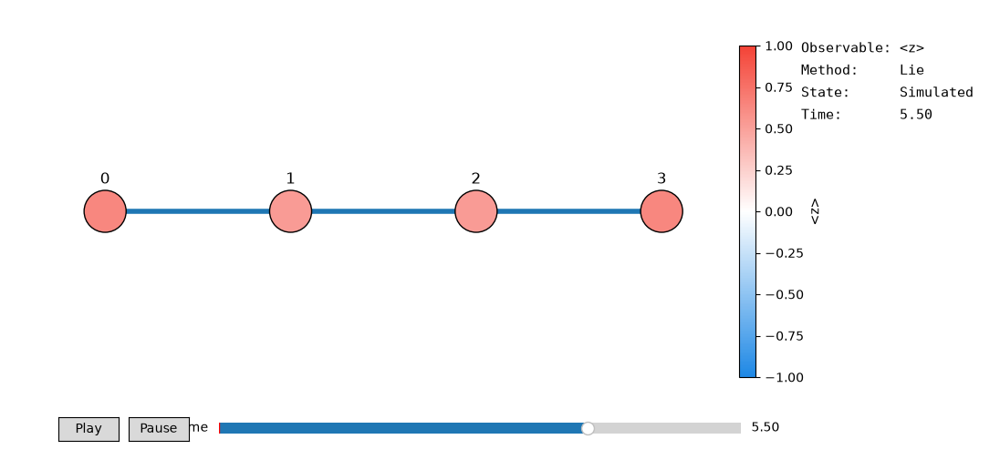

# Atlas

### A physics-first computational environment for studying quantum algorithms.

Atlas is an experimental environment for studying quantum algorithms by applying
them to explicit physical models and comparing their results against known
quantum-mechanical solutions.

> **Status:** Archived
> Atlas is no longer under active development.
> <br>
> It was developed as an experimental environment for implementing quantum algorithms
> from first principles, reproducing results from the literature, and systematically
> comparing approximate, exact, simulated, and hardware results.

---

## Experimental Method

Rather than treating an algorithm as an isolated circuit, Atlas asks how well a
computational method reproduces the behavior of a physical system, and how its
accuracy changes with parameters, approximation choices, circuit resources, and
hardware noise.

It organizes experiments around physical systems rather than quantum
software backends.

### 1. Define the system

Specify a Hamiltonian, its parameters, and the physical observables of interest.

### 2. Apply a quantum method

Run a computational method such as:

* variational ground-state search
* excited-state computation
* Hamiltonian time evolution

### 3. Compute an exact reference

For sufficiently small systems, Atlas independently computes the expected
quantum-mechanical result using exact diagonalization or exact time evolution.

This provides a reference against which approximate algorithms can be evaluated.

### 4. Measure error

Compare algorithmic results with the exact solution using quantities such as
fidelity, observable errors, and circuit-resource requirements.

### 5. Run on hardware

Variational experiments can be executed on IBM Quantum devices to compare
ideal simulation with hardware results and study the effects of noise.

### 6. Explore parameter space

Experiments can sweep quantities such as coupling strengths, evolution times,
and Trotter step sizes to investigate how physical observables and numerical
errors change.

---

## Physical Models

### Transverse-Field Ising Model

Atlas currently uses the **transverse-field Ising model (TFIM)** as its primary
test system.

The implementation includes:

* Hamiltonian construction
* exact diagonalization
* exact time evolution
* global observables
* optional site-resolved observables

---

## Quantum Methods

### VQE

Variational Quantum Eigensolver for estimating ground-state energies and
states.

### VQD

Variational Quantum Deflation for estimating excited states.

### Hamiltonian Simulation

Real-time evolution using:

* Lie-Trotter product formulas
* Strang splitting

---

## Validation

Atlas is designed so that approximate methods can be evaluated against
independently computed reference solutions.

Validation includes:

* energy and observable errors
* state fidelity
* Trotterization error
* circuit-resource analysis
* comparison between simulation and hardware results

This makes the output of an experiment a quantitative object to analyze rather
than simply a successful circuit execution.

---

## Experiment Workflow

Experiments are specified through YAML configurations and can be run as:

* single-point experiments
* parameter sweeps
* Trotter validation experiments

Each run produces timestamped outputs containing numerical results and
visualizations.

```text
configs/
    │
    ▼
Atlas experiment runner
    │
    ├── Simulator
    └── IBM Quantum
    │
    ▼
CSV + plots + experiment metadata
```

---

## Architecture

The implementation is divided into components corresponding to different parts
of the experimental workflow:

```text
Physics
├── Hamiltonians
├── Observables
└── Exact Solvers

Algorithms
├── VQE
├── VQD
└── Hamiltonian Simulation

Circuits
└── Ansatz / Evolution Circuits

Execution
├── Simulators
└── Hardware Backends

Analysis
└── Validation Metrics

Experiments
└── Configuration and Orchestration

Visualization
└── Static and Interactive Analysis
```

---

## Experimental Dashboard

Atlas also contains an experimental visualization layer for inspecting simulated
spin-chain dynamics and site-resolved observables.



> **Experimental:** The dashboard was implemented as a visualization layer and
> was not independently validated against analytical or numerical reference
> results. It should not be interpreted as evidence of physical correctness.

The dashboard consumes precomputed site-resolved observables rather than
recomputing the underlying physics.

---

## Quick Start

With dependencies from `requirements.txt` installed:

```bash
python -m atlas.main --config configs/tfim_vqe_single.yaml
python -m atlas.main --config configs/tfim_hamiltonian_sim_time_sweep.yaml
```

For the interactive lattice dashboard:

```bash
python scripts/run_lattice_dashboard.py
python scripts/run_lattice_dashboard.py \
    --config configs/tfim_hamiltonian_sim_time_sweep.yaml \
    --method strang
```

Experiment outputs are written under:

```text
atlas/data/<experiment_name>_<timestamp>/
```

See the documentation for the experiment and data-generation workflow.

---

## Documentation

* [`Usage Guide`](docs/data/data_generation_guide.md)
* [`Extension Guide`](docs/architecture/atlas_component_extension_guide.md)
* [`Architecture`](docs/architecture/architecture_analysis.md)
* [`Simulation Performance Analysis`](docs/architecture/hamiltonian_sim_performance_optimization_analysis.md)
* [`VQE Notes`](docs/validation/vqe_tfim.md)

---
