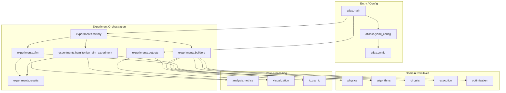
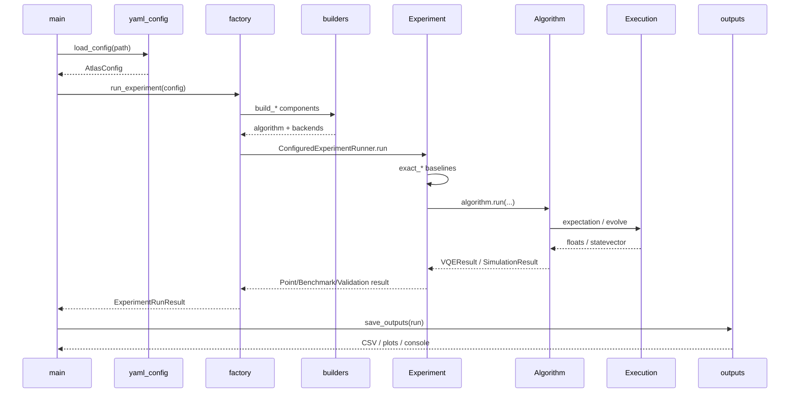
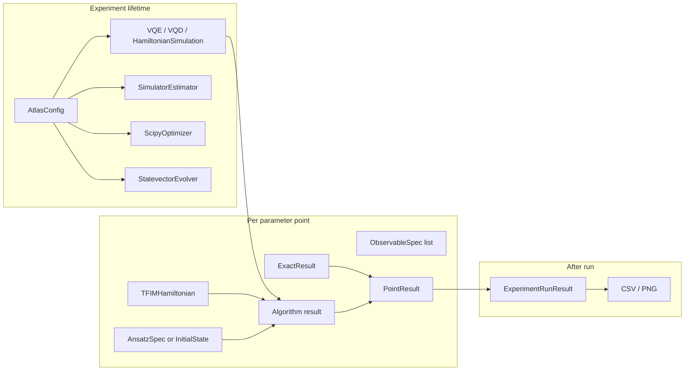
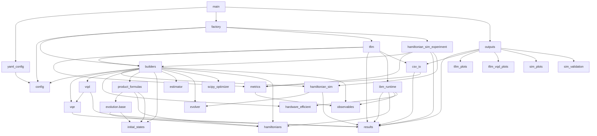

# Atlas Architecture Analysis

> **Scope:** Documentation of the *current* Atlas implementation only.  
> **Date of analysis:** 2026-07-17  
> **Codebase root:** `/home/h-livv/Projects/atlas`  
> **Source inventory:** 45 Python modules under `atlas/` (~3.8k lines)

This document explains how Atlas is structured, why each piece exists, how data and objects move through a run, and what architectural strengths and limitations follow from the present code—not from intended future design.

Cross-references use section numbers (e.g. §5 Data Flow, §9 Execution Walkthrough).

---

## Table of Contents

1. [High-Level Architecture](#1-high-level-architecture)
2. [Complete File-by-File Analysis](#2-complete-file-by-file-analysis)
3. [Class-by-Class Analysis](#3-class-by-class-analysis)
4. [Function-by-Function Analysis](#4-function-by-function-analysis)
5. [Data Flow](#5-data-flow)
6. [Object Lifetime](#6-object-lifetime)
7. [Design Decisions](#7-design-decisions)
8. [Dependency Graph](#8-dependency-graph)
9. [Execution Walkthrough](#9-execution-walkthrough)
10. [Architectural Strengths](#10-architectural-strengths)
11. [Architectural Weaknesses](#11-architectural-weaknesses)
12. [Opportunities for Future Refactoring](#12-opportunities-for-future-refactoring)

---

## 1. High-Level Architecture

### 1.1 What Atlas Is

Atlas is a **physics-first quantum simulation framework** implemented as a Python package. Experiments are driven by YAML configuration files. A thin CLI (`python -m atlas.main --config …`) loads config, builds components, runs an algorithm against a physical model, compares results to exact classical references on small systems, optionally evaluates on IBM hardware, and writes CSV/plots to a timestamped output directory.

Two algorithm families share one orchestration spine:

| Family | Algorithms | Circuit artifact | Execution primitive | Experiment class |
|--------|------------|------------------|---------------------|------------------|
| Variational | `vqe`, `vqd` | Parameterized ansatz (`AnsatzSpec`) | `SimulatorEstimator` (expectation values) | `TFIMExperiment` |
| Dynamics | `hamiltonian_sim` | Parameter-free evolution circuit (`EvolutionCircuitSpec`) | `StatevectorEvolver` (full statevector) | `HamiltonianSimExperiment` |

### 1.2 Layered Module Organization



**Why this organization exists (as implemented):**

1. **Physics-first philosophy** — Hamiltonians and observables live in `physics/` and do not depend on experiments or algorithms.
2. **Algorithm agnosticism via duck typing** — `VQE`, `VQD`, and `HamiltonianSimulation` accept objects that expose small interfaces (`.operator()`, `.circuit`, `.build_circuit()`, etc.) rather than importing TFIM types.
3. **Construction vs execution split** — `builders.py` constructs objects from YAML names; experiment classes run workflows; `outputs.py` persists artifacts.
4. **Circuit vs execution split** — circuits build Qiskit objects; execution backends run them. Algorithms orchestrate both without owning transpilation or Pauli math details.
5. **Exact reference benchmarking** — `Hamiltonian.exact_*` methods provide classical ground truth used by experiment classes before/alongside quantum methods.

### 1.3 Top-Level Packages and Directories

| Path | Purpose |
|------|---------|
| `atlas/` | Installable Python package (application code). |
| `atlas/main.py` | CLI entry: parse args → load config → run → save. |
| `atlas/config.py` | Typed configuration dataclasses + algorithm-family classifiers. |
| `atlas/physics/` | Physical models (`Hamiltonian`, TFIM) and named observables. |
| `atlas/algorithms/` | Algorithm orchestration (VQE, VQD, HamiltonianSimulation). |
| `atlas/circuits/` | Ansatzes, initial states, Trotter evolution circuit builders. |
| `atlas/execution/` | Estimators, evolvers, IBM Runtime hardware path. |
| `atlas/optimization/` | Classical optimizer wrappers (SciPy). |
| `atlas/experiments/` | Factory, builders, TFIM/dynamics workflows, results, outputs. |
| `atlas/analysis/` | Pure numerical metrics (fidelity, errors, expectations). |
| `atlas/visualization/` | Matplotlib plotting (TFIM, VQD, sim, validation registry). |
| `atlas/io/` | YAML loading/validation and CSV read/write. |
| `configs/` | Example YAML experiment configs (not imported as code). |
| `docs/` | Human documentation (this analysis lives under `docs/architecture/`). |
| `requirements.txt` | Runtime dependencies (Qiskit, SciPy, pandas, matplotlib, PyYAML, …). |
| `README.md` | Project overview and philosophy. |

### 1.4 How Modules Interact

Typical call chain for any experiment:

```text
main.main()
  → load_config(path)           # io/yaml_config → AtlasConfig
  → run_experiment(config)      # factory: build + ConfiguredExperimentRunner
       → build_experiment()     # variational → TFIMExperiment; dynamics → HamiltonianSimExperiment
       → builders.build_*()     # concrete components
       → experiment.run_*()     # algorithm.run + exact_* + metrics
  → save_outputs(run)           # outputs → csv_io / visualization / console
```

Interaction rules visible in the code:

- **`physics` never imports `experiments`** (documented in `results.py`).
- **`algorithms` never import TFIM-specific modules** (documented in `vqe.py` / `hamiltonian_sim.py`).
- **`visualization` never runs algorithms** — it only consumes result dataclasses.
- **`main` never constructs components** — construction is delegated to `factory` / `builders`.

---

## 2. Complete File-by-File Analysis

For each source file: why it exists, responsibility, interactions, dependencies, breakage impact, and assumptions. Empty `__init__.py` files are package markers with no re-exports unless noted.

### 2.1 Package Markers (Empty or Near-Empty `__init__.py`)

| File | Content | If removed |
|------|---------|------------|
| `atlas/__init__.py` | Empty | `atlas` package import may fail depending on packaging. |
| `atlas/algorithms/__init__.py` | Empty | Submodule imports under `algorithms` break as a package. |
| `atlas/analysis/__init__.py` | Empty | Same for `analysis`. |
| `atlas/circuits/__init__.py` | Empty (1 blank line) | Same for `circuits`. |
| `atlas/circuits/ansatzes/__init__.py` | Empty | Same for `ansatzes`. |
| `atlas/circuits/evolution/__init__.py` | Docstring only | Same for `evolution`. |
| `atlas/execution/__init__.py` | Empty | Same for `execution`. |
| `atlas/experiments/__init__.py` | Empty | Same for `experiments`. |
| `atlas/io/__init__.py` | Empty | Same for `io`. |
| `atlas/optimization/__init__.py` | Empty | Same for `optimization`. |
| `atlas/physics/__init__.py` | Empty | Same for `physics`. |
| `atlas/visualization/__init__.py` | Empty | Same for `visualization`. |

**Assumption:** Callers import concrete submodules (`from atlas.algorithms.vqe import VQE`), not package-level barrels.

---

### 2.2 Entry and Configuration

#### `atlas/main.py`

- **Why:** Thin CLI so experiments launch as `python -m atlas.main --config …` without embedding construction logic.
- **Responsibility:** `parse_args` → `load_config` → `run_experiment` → `save_outputs`; map any exception to exit code 1.
- **Interactions:** Depends on `io.yaml_config`, `experiments.factory`, `experiments.outputs`.
- **Dependencies:** `argparse`, `sys`, three Atlas functions above.
- **If removed:** CLI entry breaks; library APIs remain callable.
- **Assumptions:** YAML path is valid and conforms to schema; construction lives elsewhere.

#### `atlas/config.py`

- **Why:** Typed “user intent” containers; separate legacy nested configs from YAML-driven `AtlasConfig`.
- **Responsibility:** Dataclass definitions; `VARIATIONAL_ALGORITHMS` / `DYNAMICS_ALGORITHMS`; `is_variational_algorithm` / `is_dynamics_algorithm`; unused-in-app `default_tfim_config()`.
- **Interactions:** Produced by `yaml_config.load_config`; consumed by factory, builders, experiments, outputs.
- **Dependencies:** `dataclasses`, `typing` only.
- **If removed:** Entire YAML pipeline and dispatch collapse.
- **Assumptions:** Config holds intent only—never computed energies/states (those live in `experiments.results`). Legacy `ExperimentConfig` is retained but not imported by current app code.

#### `atlas/io/yaml_config.py`

- **Why:** Single place to load, validate, and map YAML → `AtlasConfig` with allow-lists.
- **Responsibility:** Schema enforcement (required sections, supported names, algorithm-specific sections, backend pairing).
- **Interactions:** Called by `main`; produces `AtlasConfig` consumed everywhere.
- **Dependencies:** `yaml`, `pathlib`, `atlas.config`.
- **If removed:** CLI cannot load configs.
- **Assumptions:** UTF-8 YAML root mapping; variational ↔ `statevector`; dynamics ↔ `statevector_evolver`; YAML `output.directory` maps to `OutputConfig.output_dir`.

#### `atlas/io/csv_io.py`

- **Why:** Isolate CSV serialization from computation/plotting; preserve TFIM benchmark column schema.
- **Responsibility:** `write_tfim_benchmark`, `write_sim_benchmark`, `write_sim_validation`, `load_hardware_results`.
- **Interactions:** Called by `outputs` and `tfim._merge_hardware_csv`; uses `analysis.metrics` for error columns.
- **Dependencies:** `numpy`, `pandas`, result types, metrics.
- **If removed:** Configured CSV export fails; console/plots can still run.
- **Assumptions:** Result objects expose accessors used by writers; missing hardware → NaN columns (schema stability).

---

### 2.3 Physics

#### `atlas/physics/hamiltonians.py`

- **Why:** Physical models → qubit operators + dense exact solvers for small-system benchmarks.
- **Responsibility:** `ExactResult`, abstract `Hamiltonian`, `TFIMHamiltonian` (open-boundary TFIM).
- **Interactions:** Built by `builders.build_hamiltonian`; used by algorithms (duck-typed), evolution methods, experiment exact baselines, IBM layout application.
- **Dependencies:** `numpy`, `scipy.linalg.expm`, Qiskit `SparsePauliOp`.
- **If removed:** All TFIM experiments and exact baselines fail.
- **Assumptions:** Open boundaries (no periodic ZZ); dense `2^n` matrices for exact methods; must not import experiments.

#### `atlas/physics/observables.py`

- **Why:** Post-run measurement operators are metrics, not Hamiltonian terms, but share Pauli conventions.
- **Responsibility:** `ObservableSpec`, `tfim_observables` (total `x`; first-bond `zz` only when `n≥2`).
- **Interactions:** Built via `build_observables`; measured in experiments and hardware evaluate.
- **Dependencies:** `dataclasses`, `SparsePauliOp`.
- **If removed:** Default TFIM analysis path fails.
- **Assumptions:** ZZ is first bond only (legacy match), not sum over all bonds; coefficients +1.0.

---

### 2.4 Algorithms

#### `atlas/algorithms/vqe.py`

- **Why:** Generic multi-start VQE decoupled from TFIM/ansatz/hardware.
- **Responsibility:** Minimize estimator cost over ansatz parameters; keep best of `num_starts`.
- **Interactions:** Built by builders; used by `TFIMExperiment`; composed by `VQD`; returns `VQEResult`.
- **Dependencies:** `numpy`, `VQEResult`.
- **If removed:** Variational ground-state and VQD paths break.
- **Assumptions:** Duck-typed Hamiltonian/ansatz/optimizer/estimator interfaces; optimizer exposes `.method`.

#### `atlas/algorithms/vqd.py`

- **Why:** Excited-state search via sequential deflation reusing VQE multi-start.
- **Responsibility:** Ground via `VQE.run`; excited via deflated cost + `VQE._optimize_cost`.
- **Interactions:** Built when `algorithm.name == "vqd"`; requires `ansatz.bind` and exact statevectors for overlaps.
- **Dependencies:** Qiskit `Statevector`/`state_fidelity`, `VQE`, result types.
- **If removed:** VQD experiments fail only.
- **Assumptions:** Exact statevector overlaps (not shot-based); private `_optimize_cost` is part of the contract.

#### `atlas/algorithms/hamiltonian_sim.py`

- **Why:** Orchestrate time evolution without owning Trotter math or physical models.
- **Responsibility:** `build_circuit` → `evolve` → `SimulationResult`.
- **Interactions:** Built by builders; used by `HamiltonianSimExperiment`.
- **Dependencies:** `StatevectorEvolver` (type hint), `SimulationResult`.
- **If removed:** Dynamics experiments break.
- **Assumptions:** Evolution method returns a spec with circuit metadata; evolver returns `.statevector`.

---

### 2.5 Circuits

#### `atlas/circuits/initial_states.py`

- **Why:** Dynamics needs pure preparation circuits distinct from parameterized ansätze.
- **Responsibility:** `InitialStateSpec`, `ComputationalBasisState`, `default_initial_state`.
- **Interactions:** Built by `build_initial_state`; composed into Trotter circuits; `.statevector()` for exact evolution baseline.
- **Dependencies:** Qiskit circuit/statevector, `numpy`.
- **If removed:** Dynamics preparation and exact fidelity baselines break.
- **Assumptions:** Bitstring length equals `num_qubits`; chars ∈ {0,1}.

#### `atlas/circuits/ansatzes/hardware_efficient.py`

- **Why:** Single source of truth for the hardware-efficient ansatz used by VQE/VQD/hardware.
- **Responsibility:** `AnsatzSpec`, `build_hardware_efficient_ansatz` (RY layers + linear CX chain).
- **Interactions:** Built by `build_ansatz`; bound in experiments/VQD/IBM.
- **Dependencies:** Qiskit `ParameterVector`, `QuantumCircuit`.
- **If removed:** All variational paths lose their ansatz.
- **Assumptions:** 1D connectivity; `num_parameters = n*(reps+1)`.

#### `atlas/circuits/evolution/base.py`

- **Why:** Shared types for deterministic evolution circuits (parallel to `AnsatzSpec`).
- **Responsibility:** `EvolutionCircuitSpec`, abstract `EvolutionMethod`.
- **Interactions:** Implemented by product formulas; consumed by `HamiltonianSimulation`.
- **Dependencies:** `abc`, Qiskit, `InitialStateSpec`, `Hamiltonian`.
- **If removed:** No shared evolution contract.
- **Assumptions:** Hamiltonian/initial-state duck types as documented on the ABC.

#### `atlas/circuits/evolution/product_formulas.py`

- **Why:** Implement Lie (1st-order) and Strang (2nd-order) Trotter product formulas.
- **Responsibility:** `_pauli_terms`, `_apply_pauli_evolution`, `_ProductFormulaBase`, `LieTrotter`, `StrangTrotter`.
- **Interactions:** Built by builders; used only on dynamics path.
- **Dependencies:** Qiskit `PauliEvolutionGate`, base types, physics/initial_states.
- **If removed:** Approximate quantum dynamics unavailable (exact classical evolution remains).
- **Assumptions:** Hermitian Pauli sum; evolution uses `coeff.real`; `num_trotter_steps ≥ 1`.

---

### 2.6 Execution and Optimization

#### `atlas/execution/estimator.py`

- **Why:** Own Qiskit `StatevectorEstimator` so VQE never builds pubs directly.
- **Responsibility:** `SimulatorEstimator.expectation` / `.statevector`.
- **Interactions:** Injected into `VQE`; built when `backend.name == "statevector"`.
- **Dependencies:** Qiskit primitives / quantum_info.
- **If removed:** Local variational cost evaluation fails.
- **Assumptions:** Ideal noiseless simulation; parameter length matches circuit.

#### `atlas/execution/evolver.py`

- **Why:** Distinct primitive for one-shot full-state evolution (not repeated expectations).
- **Responsibility:** `EvolutionResult`, `StatevectorEvolver.evolve`.
- **Interactions:** Injected into `HamiltonianSimulation`.
- **Dependencies:** `numpy`, Qiskit.
- **If removed:** Dynamics execution backend gone.
- **Assumptions:** Circuit fits in classical memory; fully bound; no noise.

#### `atlas/execution/simulator.py`

- **Why:** Backward-compatible re-export after estimator/evolver split.
- **Responsibility:** Re-export `SimulatorEstimator`; docstring steers new code elsewhere.
- **Interactions:** None in current `atlas/` callers (orphaned compatibility shim).
- **If removed:** Only breaks external importers of the old path.
- **Assumptions:** Prefer `estimator` / `evolver` modules.

#### `atlas/execution/ibm_runtime.py`

- **Why:** Encapsulate transpile/layout/resilience/`EstimatorV2` without rebuilding physics/circuits.
- **Responsibility:** `IBMRuntimeEstimator.evaluate` → `HardwareEvaluationResult`.
- **Interactions:** Called from `TFIMExperiment` when `mode=="hardware"`.
- **Dependencies:** `qiskit_ibm_runtime`, pass manager, result/physics/ansatz types.
- **If removed:** Live hardware validation path fails (sim still works).
- **Assumptions:** Caller resolved authenticated backend; ansatz fits backend qubits.

#### `atlas/optimization/scipy_optimizer.py`

- **Why:** Thin SciPy wrapper reusable by any scalar variational cost.
- **Responsibility:** `OptimizerRunResult`, `ScipyOptimizer.minimize`.
- **Interactions:** Built by `build_optimizer`; used once per VQE multi-start.
- **Dependencies:** `scipy.optimize.minimize`, `numpy`.
- **If removed:** Default variational optimizer path fails.
- **Assumptions:** Cost is scalar; does not check `result.success`.

---

### 2.7 Experiments

#### `atlas/experiments/factory.py`

- **Why:** Top-level assembly and dispatch from `AtlasConfig` into a runnable experiment.
- **Responsibility:** Hardware backend resolution; variational vs dynamics build; `ConfiguredExperimentRunner` for `single_point` / `sweep` / `trotter_validation`; `ExperimentRunResult`.
- **Interactions:** Called by `main`; uses builders + both experiment classes.
- **Dependencies:** config helpers, builders, experiment classes, result union types, optional IBM Runtime.
- **If removed:** CLI orchestration dead.
- **Assumptions:** Soft fallback to sim if IBM unavailable; system params include `num_qubits`, `J`, `h`.

#### `atlas/experiments/builders.py`

- **Why:** Pure construction layer—map YAML names to objects without running algorithms.
- **Responsibility:** All `build_*` and `resolve_*` helpers (Hamiltonian, ansatz, optimizer, estimator, evolver, evolution methods, initial state, algorithms, observables, evolution time).
- **Interactions:** Called by factory and both experiment classes (per-point rebuilds).
- **Dependencies:** algorithms, circuits, execution, optimization, physics, config.
- **If removed:** No component assembly.
- **Assumptions:** Currently only TFIM + hardware_efficient + scipy + statevector backends.

#### `atlas/experiments/tfim.py`

- **Why:** TFIM-specific variational workflow (exact + VQE/VQD + optional hardware/CSV merge).
- **Responsibility:** Point context build; single-point and sweep runners; hardware CSV merge for VQE sweeps.
- **Interactions:** Driven by factory; uses builders, metrics, IBM estimator, results.
- **Dependencies:** See imports in file.
- **If removed:** All VQE/VQD experiments fail.
- **Assumptions:** Algorithm exposes `.run(hamiltonian, ansatz)`; VQD exposes `.num_states`; CSV columns match merge schema. VQD sweep does not call `_merge_hardware_csv`.

#### `atlas/experiments/hamiltonian_sim_experiment.py`

- **Why:** Dynamics workflow—exact time evolution vs Trotterized simulation.
- **Responsibility:** `_evaluate_point`, single-point, parameter sweeps, Trotter validation grid.
- **Interactions:** Driven by factory; rebuilds `HamiltonianSimulation` when steps/methods change.
- **Dependencies:** builders, metrics, results, `HamiltonianSimulation`.
- **If removed:** Dynamics / Trotter validation fail.
- **Assumptions:** Exact evolution available; no hardware path for dynamics.

#### `atlas/experiments/results.py`

- **Why:** Shared typed records replacing legacy parallel arrays.
- **Responsibility:** All result dataclasses and aggregate accessors for CSV/plots.
- **Interactions:** Produced by algorithms/experiments; consumed by I/O and visualization.
- **Dependencies:** `numpy` only (intentionally thin).
- **If removed:** Cascade failure through experiments/I/O/viz.
- **Assumptions:** Physics never imports this module; observable dict keys stable (`zz`, `x`).

#### `atlas/experiments/outputs.py`

- **Why:** Persist and present finished runs without owning physics/algorithms.
- **Responsibility:** Timestamped run dirs; `isinstance` dispatch to CSV/plots/console; VQD CSV written inline with pandas (others use `csv_io`).
- **Interactions:** Called by `main`; fans out to viz + csv_io.
- **Dependencies:** result types, viz modules, csv_io, numpy/pandas.
- **If removed:** Runs complete but produce no artifacts.
- **Assumptions:** Result type matches experiment family; output flags honored.

---

### 2.8 Analysis and Visualization

#### `atlas/analysis/metrics.py`

- **Why:** Pure numerical post-processing—no jobs, no plots.
- **Responsibility:** `state_fidelity_to_exact`, `expectation_values`, `absolute_error`, `relative_error_percent`.
- **Interactions:** Called by both experiment classes and `csv_io`.
- **Dependencies:** Qiskit, `ObservableSpec`.
- **If removed:** Scoring in experiments fails.
- **Assumptions:** `relative_error_percent` divides by `|reference|` (zero reference undefined).

#### `atlas/visualization/circuit_drawer.py`

- **Why:** Thin Qiskit circuit drawing wrapper.
- **Responsibility:** `draw_circuit` → mpl save or other formats.
- **Interactions:** **No in-repo callers** (orphaned utility).
- **If removed:** No pipeline breakage today.
- **Assumptions:** Matplotlib available for `mpl` format.

#### `atlas/visualization/tfim_plots.py`

- **Why:** VQE TFIM benchmark/single-point plots; hardware series degrade gracefully.
- **Responsibility:** Energy, magnetization, errors, parity, relative error, fidelity, single-point bar, `plot_all_tfim`.
- **Interactions:** Called from `outputs` VQE save paths.
- **If removed:** VQE plots fail; CSV/console remain.

#### `atlas/visualization/tfim_vqd_plots.py`

- **Why:** VQD single-point and sweep visualization.
- **Responsibility:** Multi-panel summaries and per-state series; `plot_all_tfim_vqd`.
- **Interactions:** Called from `outputs` VQD save paths.
- **If removed:** VQD plots fail.

#### `atlas/visualization/sim_plots.py`

- **Why:** Passive plots for dynamics point/sweep results.
- **Responsibility:** Observable bars, fidelity/observable vs sweep, `plot_all_sim`.
- **Interactions:** Called from `outputs` sim save paths.
- **If removed:** Dynamics plots fail.

#### `atlas/visualization/sim_validation/` package

| File | Role |
|------|------|
| `__init__.py` | Re-exports; `plot_validation_result(result, output_dir)`. |
| `registry.py` | Global plot/renderer registries; default plot name tuple. |
| `series.py` | Metric accessors, `ValidationPlotSpec`, series helpers. |
| `plots.py` | `render_method_comparison`, default registration at import, `plot_validation_comparison`. |

- **Why:** Registry-driven multi-method Trotter comparison plots.
- **Interactions:** Called from `outputs` for validation and some step sweeps.
- **If removed:** Validation plots fail; CSV/console remain.
- **Assumptions:** Series list is non-empty for meaningful plots; defaults registered on import of `plots`.

---

## 3. Class-by-Class Analysis

### 3.1 Configuration Classes (`atlas/config.py`)

#### Legacy stack (compatibility; not used by YAML path in current app code)

| Class | Purpose | Key members | Lifecycle |
|-------|---------|-------------|-----------|
| `TFIMConfig` | Physical TFIM params | `num_qubits`, `J`, `h`, `h_values` | Nested default of `ExperimentConfig` |
| `OptimizerConfig` | Optimizer settings | `method`, `maxiter`, `num_starts` | Same |
| `SimulatorConfig` | Sim seed | `seed` | Same |
| `HardwareConfig` | IBM settings | `provider`, `enabled`, `backend_name`, resilience/optimization levels, `hardware_csv_path` | Also used by `AtlasConfig` |
| `OutputConfig` | Output toggles/paths | `output_dir`, `csv`, `plots` | Shared |
| `ExperimentConfig` | Legacy aggregate root | nested sub-configs | Via `default_tfim_config()` |

#### YAML-driven stack

| Class | Purpose | Key members | Relationships |
|-------|---------|-------------|---------------|
| `ExperimentMetaConfig` | Experiment kind | `type`, `name` | Child of `AtlasConfig` |
| `SystemConfig` | Physical system | `name`, `parameters`, `sweep` | Child |
| `AlgorithmConfig` | Algorithm selection | `name`, `parameters` | Child |
| `AnsatzConfig` | Circuit family | `name`, `parameters` | Required for variational |
| `OptimizerSettingsConfig` | Named optimizer | `name`, `parameters` | Required for variational |
| `BackendConfig` | Estimator/evolver | `name`, `parameters` | Child |
| `InitialStateConfig` | Dynamics ψ₀ | `name`, `parameters` | Optional on `AtlasConfig` |
| `AnalysisConfig` | Post-run analysis | `observables`, `fidelity` | Child |
| `AtlasConfig` | Top-level YAML config | all of the above + hardware/output | Produced by `load_config` |

**Member variable pattern (all config dataclasses):** initialized at construction by `load_config` or defaults; treated as immutable-by-convention (not `frozen=True`); consumed read-only by factory/builders/experiments/outputs.

---

### 3.2 Physics Classes

#### `ExactResult`
- **Purpose:** Uniform container for exact eigenpairs / evolved states.
- **Members:** `energy: float`, `statevector: np.ndarray` — set at construction by `exact_*` methods.
- **Lifecycle:** Created during experiment evaluation; fields copied into point results; then GC’d with the point context.
- **Dependents:** Experiment classes reading energy/statevector.

#### `Hamiltonian`
- **Purpose:** Minimal interface: `operator()` + `num_qubits`, plus dense exact solvers.
- **Members:** `num_qubits` set in `__init__`.
- **Public interface:** `operator()`, `exact_ground_state()`, `exact_spectrum(num_states)`, `exact_time_evolution(initial_state, time)`.
- **Internal state:** Only `num_qubits` on the base; no cached matrix.
- **Lifecycle:** Constructed per `(J,h)` point; used for algorithm + exact reference; discarded after point evaluation.
- **Architecture fit:** Physics core; algorithms duck-type it; exact methods enable benchmarking.

#### `TFIMHamiltonian(Hamiltonian)`
- **Purpose:** Open-boundary TFIM \(H = -J\sum Z_i Z_{i+1} - h\sum X_i\).
- **Members:** `J`, `h` (+ inherited `num_qubits`) — init in `__init__`; constant for object lifetime.
- **`operator()`:** Builds Pauli list each call (no caching).
- **Dependents:** All current experiments (only supported system name `"tfim"`).

#### `ObservableSpec`
- **Purpose:** Named measurement operator.
- **Members:** `name`, `operator` — set at construction in `tfim_observables`; immutable thereafter.
- **Dependents:** metrics, hardware evaluate, CSV columns.

---

### 3.3 Circuit Classes

#### `InitialStateSpec` / `ComputationalBasisState`
- **Purpose:** Pure-state preparation for dynamics.
- **Members:** `num_qubits`; `ComputationalBasisState.bitstring` validated in `__post_init__`.
- **Public interface:** `preparation_circuit()`, `statevector()`.
- **Lifecycle:** Built once per point context; used for circuit compose + exact baseline.
- **Relationships:** Consumed by `EvolutionMethod.build_circuit`.

#### `AnsatzSpec`
- **Purpose:** Bundle parameterized circuit + parameter metadata.
- **Members:** `circuit`, `parameters`, `num_qubits` — set by factory function; held for whole variational run.
- **Public interface:** `num_parameters`, `bind(values)`.
- **Dependents:** VQE/VQD/IBM/TFIMExperiment.

#### `EvolutionCircuitSpec`
- **Purpose:** Evolution circuit + metadata for results packaging.
- **Members:** `circuit`, `num_qubits`, `num_trotter_steps`, `evolution_time`, `method_name`; property `circuit_depth`.
- **Lifecycle:** Created per `build_circuit`; handed to evolver; metadata copied into `SimulationResult`.

#### `EvolutionMethod` (ABC) / `_ProductFormulaBase` / `LieTrotter` / `StrangTrotter`
- **Purpose:** Strategy: Hamiltonian + ψ₀ + t → circuit.
- **Members:** `num_trotter_steps` on product-formula base.
- **Public interface:** `name`, `build_circuit(...)`.
- **Lifecycle:** Injected into `HamiltonianSimulation`; may be rebuilt when steps change in sweeps/validation.
- **Relationships:** Implements ABC; used only by dynamics algorithm/experiment.

---

### 3.4 Algorithm Classes

#### `VQE`
- **Purpose:** Multi-start classical optimization of estimator-based energy.
- **Members:**

| Member | Init | Changes | Dependents |
|--------|------|---------|------------|
| `estimator` | `__init__` | Held constant | Cost evaluation |
| `optimizer` | `__init__` | Held constant | Each start |
| `num_starts` | `__init__` | Fixed | Loop bound |
| `seed` | `__init__` | Fixed | RNG setup |
| `_rng` | `__init__` if seed set | Used for draws | Initial points |

- **Public interface:** `run(hamiltonian, ansatz)`; also `_optimize_cost` used by VQD.
- **Lifecycle:** Built once per experiment; reused across sweep points.
- **Architecture fit:** Algorithm layer; no TFIM knowledge.

#### `VQD`
- **Purpose:** Sequential deflation for `num_states` eigenstates.
- **Members:** `vqe`, `num_states`, `beta` — all init-time constants.
- **Local run state:** `states`, `previous_statevectors` lists grow during `run`.
- **Relationships:** Composes `VQE`; returns `VQDResult`.
- **Assumption:** Overlaps via exact statevectors.

#### `HamiltonianSimulation`
- **Purpose:** Wire evolution method + evolver for one dynamics run.
- **Members:** `evolution_method`, `evolver`.
- **Public interface:** `run(hamiltonian, initial_state, evolution_time)`.
- **Lifecycle:** Built at experiment start; often replaced with a fresh instance when Trotter steps/methods change (reusing the same evolver).

---

### 3.5 Execution / Optimization Classes

#### `SimulatorEstimator`
- **Member:** `_estimator` (`StatevectorEstimator`) created in `__init__`.
- **Interface:** `expectation(circuit, observable, parameter_values)`, `statevector(bound_circuit)`.
- **Lifecycle:** One per variational experiment; many expectation calls during optimization.

#### `StatevectorEvolver` / `EvolutionResult`
- **Evolver:** Stateless (no instance fields).
- **`EvolutionResult`:** `statevector`, `num_qubits` set in `evolve`.
- **Lifecycle:** Evolver reused; results ephemeral until copied into `SimulationResult`.

#### `IBMRuntimeEstimator`
- **Members:** `backend`, `resilience_level`.
- **Interface:** `evaluate(ansatz, hamiltonian, parameter_values, observables)`.
- **Lifecycle:** Created per hardware evaluation call inside TFIM experiment methods.
- **Side effects:** Network job submission.

#### `ScipyOptimizer` / `OptimizerRunResult`
- **Members:** `method`, `maxiter` on optimizer; result holds `energy`, `parameters`, `nfev`.
- **Lifecycle:** Optimizer long-lived; each `minimize` produces a new result consumed by VQE.

---

### 3.6 Experiment / Result Classes

#### `TFIMExperiment`
- **Members:** `config`, `algorithm`, `num_qubits`, `resilience_level`, `compute_fidelity`.
- **Responsibilities:** Point context, VQE/VQD single-point and sweeps, optional hardware + CSV merge.
- **Lifecycle:** Built by factory; lives for one `ConfiguredExperimentRunner.run`.

#### `HamiltonianSimExperiment`
- **Members:** `config`, `algorithm`, `num_qubits`, `compute_fidelity`.
- **Responsibilities:** Exact vs sim evaluation, sweeps, Trotter validation.
- **Lifecycle:** Same as above for dynamics.

#### `ConfiguredExperimentRunner` / `ExperimentRunResult`
- **Runner members:** `config`, `experiment`.
- **`ExperimentRunResult`:** `config`, `result` (union), `experiment_type`, `algorithm_name` — produced at end of `run`, consumed by `save_outputs`.

#### Result dataclasses (summary)

| Class | Owns | Aggregate role |
|-------|------|----------------|
| `VQEResult` | energy, params, nfev, metadata | Nested in TFIM points / VQD states |
| `VQDResult` | list of `VQEResult` | Nested in TFIM VQD points |
| `HardwareEvaluationResult` | HW energy/obs/job_id/stderr | Optional on TFIM points |
| `TFIMPointResult` | exact + VQE + metrics + HW | Sweep element |
| `TFIMVQDPointResult` | spectrum + VQD + per-state metrics | Sweep element |
| `TFIMBenchmarkResult` / `TFIMVQDBenchmarkResult` | list of points | Sweep container |
| `SimulationResult` | statevector + Trotter metadata | Nested in sim points |
| `SimPointResult` | exact vs sim + obs errors | Sweep element |
| `SimBenchmarkResult` | sweep param + points | Sweep / validation series |
| `SimValidationResult` | multi-method series | Validation container |

Members are set at construction and generally not mutated afterward (exception: `TFIMExperiment._merge_hardware_csv` assigns `point.hardware_result`).

---

### 3.7 Visualization Supporting Classes

#### `ValidationPlotSpec` (`sim_validation/series.py`)
- Frozen dataclass describing a plot (name, filename, x/y metrics/labels, title, log flags).
- Registered into module-level dicts at import time of `plots.py`.
- Renderers consume series lists and write PNG files.

---

## 4. Function-by-Function Analysis

Functions are grouped by module. For each: purpose, inputs, outputs, side effects, dependencies, algorithm notes, callers, and why helpers are separated when relevant.

### 4.1 `atlas/main.py`

| Function | Purpose | Inputs | Outputs | Side effects | Callers |
|----------|---------|--------|---------|--------------|---------|
| `parse_args(argv=None)` | Define `--config` CLI | optional argv | `Namespace` | none | `main` |
| `main(argv=None)` | Orchestrate one run | optional argv | none | prints errors; filesystem via save; may `SystemExit(1)` | `__main__` |

**Algorithm of `main`:** try `load_config` → `run_experiment` → `save_outputs`; on any exception print to stderr and exit 1.

---

### 4.2 `atlas/config.py`

| Function / constant | Purpose | Callers |
|---------------------|---------|---------|
| `default_tfim_config()` | Legacy default `ExperimentConfig` | none in current app code |
| `VARIATIONAL_ALGORITHMS` / `DYNAMICS_ALGORITHMS` | Allow-sets | yaml_config, classifiers |
| `is_variational_algorithm(name)` | Dispatch/validation | yaml_config, factory, builders |
| `is_dynamics_algorithm(name)` | Dispatch/validation | same |

---

### 4.3 `atlas/io/yaml_config.py`

| Function | Purpose | Why separated |
|----------|---------|---------------|
| `_section` | Require mapping section | Shared validation |
| `_optional_section` | Optional mapping or None | Shared validation |
| `_named_section` | Require `name` ∈ supported + parameters dict | Shared validation |
| `_validate_variational_sections` | Build ansatz + optimizer configs | Branch-specific |
| `_validate_dynamics_sections` | Build initial_state (default computational) | Branch-specific |
| `load_config(path)` | Full YAML→`AtlasConfig` pipeline | Public entry |

**`load_config` algorithm:**
1. `yaml.safe_load`
2. Require top-level sections in `_REQUIRED_SECTIONS`
3. Validate experiment type, system name, algorithm name
4. If variational: require ansatz/optimizer; else leave defaults
5. If dynamics: validate evolution method(s), trotter_validation steps list, initial_state
6. Enforce backend pairing (variational↔statevector, dynamics↔statevector_evolver)
7. Validate hardware/analysis/output; map `directory`→`output_dir`
8. Return `AtlasConfig`

**Side effects:** filesystem read only. **Callers:** `main.main`.

---

### 4.4 `atlas/io/csv_io.py`

| Function | Purpose | Inputs | Outputs | Side effects | Callers |
|----------|---------|--------|---------|--------------|---------|
| `_hardware_field(result, getter)` | Per-point HW field or NaN | benchmark, getter | list | none | `write_tfim_benchmark` |
| `write_tfim_benchmark` | VQE sweep CSV | `TFIMBenchmarkResult`, path | none | writes CSV | outputs |
| `load_hardware_results` | Read HW CSV | path | DataFrame | disk read | `tfim._merge_hardware_csv` |
| `write_sim_benchmark` | Dynamics sweep CSV | `SimBenchmarkResult`, path | none | writes CSV | outputs |
| `write_sim_validation` | Flatten multi-method series | `SimValidationResult`, path | none | writes CSV | outputs |

**Why `_hardware_field` is separate:** keeps sparse hardware column logic out of the dense column-building loop.

---

### 4.5 Physics

#### `Hamiltonian` methods
| Method | Purpose | Algorithm | Callers |
|--------|---------|-----------|---------|
| `operator()` | Abstract SparsePauliOp | subclass | algorithms, evolution, IBM |
| `exact_ground_state()` | Dense eigh → ground | `eigh`, argmin | `TFIMExperiment.run_single_point` |
| `exact_spectrum(num_states)` | Lowest eigenpairs | `eigh` + argsort | `run_single_point_vqd` |
| `exact_time_evolution(ψ₀, t)` | `expm(-iHt)ψ`, renormalize, ⟨H⟩ | dense expm | `HamiltonianSimExperiment._evaluate_point` |

#### `TFIMHamiltonian.operator()`
Builds ZZ bonds for `i=0..n-2` and X fields for all sites; returns `SparsePauliOp.from_list`.

#### `tfim_observables(num_qubits)`
Builds total X; if `n≥2` inserts first-bond ZZ at index 0. **Caller:** `build_observables`.

---

### 4.6 Algorithms

#### `VQE`
| Method | Purpose | Inputs | Outputs | Side effects |
|--------|---------|--------|---------|--------------|
| `_draw_initial_point(size)` | Uniform `[0,2π)` | size | ndarray | advances RNG |
| `_optimize_cost(cost_fn, ansatz, num_qubits)` | Multi-start loop | cost, ansatz, n | `VQEResult` | many optimizer/estimator calls |
| `run(hamiltonian, ansatz)` | Energy minimization | H, ansatz | `VQEResult` | same |

**Why `_draw_initial_point` separated:** isolates seeded vs global RNG.  
**Why `_optimize_cost` separated:** VQD reuses multi-start without reimplementing it.  
**Callers of `run`:** `TFIMExperiment`, `VQD.run`. **Callers of `_optimize_cost`:** `run`, `VQD.run`.

#### `VQD.run`
1. Ground: `vqe.run`
2. Bind → Statevector; append
3. For each subsequent state: cost = energy + β Σ |⟨ψ|ψₖ⟩|²; optimize via `_optimize_cost`
4. Return `VQDResult`

**Closure note:** `prev=previous_statevectors` default captures the list by reference so later appends are visible—intentional sequential deflation.

#### `HamiltonianSimulation.run`
`build_circuit` → `evolver.evolve` → pack `SimulationResult`. **Caller:** experiment `_evaluate_point` / rebuilt algorithms.

---

### 4.7 Circuits

| Function / method | Purpose | Callers |
|-------------------|---------|---------|
| `InitialStateSpec.preparation_circuit` | Prep circuit | product formulas, `statevector` |
| `InitialStateSpec.statevector` | Dense amplitudes via Statevector | dynamics exact baseline |
| `ComputationalBasisState.__post_init__` | Validate bitstring | construction |
| `ComputationalBasisState.preparation_circuit` | X on |1⟩ bits | evolution compose |
| `default_initial_state(n)` | All-zero computational | convenience (unused in-repo path; builders use config) |
| `AnsatzSpec.bind` | Assign parameters | TFIM, VQD, IBM |
| `build_hardware_efficient_ansatz` | Build HEA | `build_ansatz` |
| `EvolutionCircuitSpec.circuit_depth` | `circuit.depth()` | SimulationResult packaging |
| `_pauli_terms` | Deterministic Pauli list | product formulas |
| `_apply_pauli_evolution` | Append PauliEvolutionGate | step builders |
| `_ProductFormulaBase._compose_circuit` | Prep + Trotter loop | Lie/Strang |
| `LieTrotter.build_circuit` | First-order product | builders |
| `StrangTrotter.build_circuit` | Symmetric product | builders |

**Why `_pauli_terms` / `_apply_pauli_evolution` separated:** shared by Lie and Strang; Strang needs reverse pass over the same ordered list.

---

### 4.8 Execution / Optimization

| Method | Purpose | Side effects | Callers |
|--------|---------|--------------|---------|
| `SimulatorEstimator.expectation` | EstimatorV pub → float | statevector sim | VQE cost |
| `SimulatorEstimator.statevector` | Bound circuit → Statevector | sim | available helper |
| `StatevectorEvolver.evolve` | Circuit → `EvolutionResult` | sim | HamiltonianSimulation |
| `IBMRuntimeEstimator.evaluate` | Bind, transpile, EstimatorV2 | network job | TFIM hardware mode |
| `ScipyOptimizer.minimize` | One SciPy minimize | none (CPU) | VQE multi-start |

---

### 4.9 Builders (`experiments/builders.py`)

| Function | Builds / returns | Raises if |
|----------|------------------|-----------|
| `build_hamiltonian` | `TFIMHamiltonian` | unknown system |
| `build_ansatz` | HEA | unknown ansatz |
| `build_optimizer` | `ScipyOptimizer` | unknown optimizer |
| `build_estimator` | `SimulatorEstimator` | non-statevector |
| `build_evolver` | `StatevectorEvolver` | non-statevector_evolver |
| `build_evolution_method_named` | Lie/Strang | unknown method |
| `build_evolution_method` | from config (first list element if steps is list) | via named |
| `resolve_evolution_methods` | list[str] | empty/non-list |
| `resolve_trotter_step_values` | list[int] | — |
| `build_initial_state` | ComputationalBasisState | unknown name |
| `build_vqe` | VQE | — |
| `build_variational_algorithm` | VQE or VQD | unknown |
| `build_hamiltonian_simulation` | HamiltonianSimulation | — |
| `build_algorithm` | category dispatch | missing deps |
| `build_observables` | TFIM specs | unknown |
| `resolve_evolution_time` | float (system then algo default 1.0) | — |

**Why so many small builders:** each maps one YAML name→object and fails fast with an allow-list message; factory and experiments can call them independently for per-point overrides.

---

### 4.10 Factory (`experiments/factory.py`)

| Function / method | Purpose | Callers |
|-------------------|---------|---------|
| `resolve_hardware_backend` | IBM named or least-busy | runner `_execution_mode_and_backend` |
| `_build_variational_experiment` | Wire VQE/VQD stack → TFIMExperiment | `build_experiment` |
| `_build_dynamics_experiment` | Wire sim stack → HamiltonianSimExperiment | `build_experiment` |
| `build_experiment` | Category dispatch | `run_experiment` |
| `ConfiguredExperimentRunner.run` | Type dispatch | `run_experiment` |
| `_execution_mode_and_backend` | sim vs hardware | single_point / sweep |
| `_run_single_point` / `_run_sweep` / `_run_trotter_validation` | Concrete runners | `run` |
| `run_experiment` | build + run | `main` |

**Side effects:** `resolve_hardware_backend` may print credential/backend errors and return `None` (soft fallback).

---

### 4.11 Experiment Workflows

#### `TFIMExperiment`
| Method | Purpose | Outputs |
|--------|---------|---------|
| `_build_point_context(J,h)` | H, ansatz, observables | tuple |
| `run_single_point` | Exact GS + VQE + metrics (+ HW) | `TFIMPointResult` |
| `run_single_point_vqd` | Exact spectrum + VQD + metrics (+ HW on GS) | `TFIMVQDPointResult` |
| `run_sweep` | Loop VQE + optional CSV merge | `TFIMBenchmarkResult` |
| `run_sweep_vqd` | Loop VQD (no CSV merge) | `TFIMVQDBenchmarkResult` |
| `_merge_hardware_csv` | Mutate points with CSV HW | none |

Helper `_optional_float` maps pandas NaN → None for stderr fields.

#### `HamiltonianSimExperiment`
| Method | Purpose | Outputs |
|--------|---------|---------|
| `_build_point_context` | H, ψ₀, observables | tuple |
| `_evaluate_point` | Exact evolution + sim + fidelity/obs errors | `SimPointResult` |
| `run_single_point` | Optional step rebuild then evaluate | `SimPointResult` |
| `run_sweep` | Sweep `evolution_time` / `h` / `num_trotter_steps` | `SimBenchmarkResult` |
| `run_trotter_validation` | Methods × steps grid | `SimValidationResult` |

**Why `_evaluate_point` separated:** shared by single-point, sweeps, and validation without duplicating exact/sim/metrics logic.

---

### 4.12 Analysis Metrics

| Function | Purpose | Algorithm | Callers |
|----------|---------|-----------|---------|
| `state_fidelity_to_exact` | Fidelity | Qiskit `state_fidelity` | both experiments |
| `expectation_values` | Named ⟨O⟩ | circuit→SV if needed | both experiments |
| `absolute_error` | \|ref−val\| | abs | sim experiment, csv |
| `relative_error_percent` | percent error | abs/\|ref\|*100 | csv_io |

---

### 4.13 Outputs and Visualization (high-signal)

| Function | Purpose | Side effects |
|----------|---------|--------------|
| `resolve_run_output_dir` | `{output_dir}/{name}_{timestamp}/` | creates directory |
| `save_outputs` | `isinstance` fan-out | prints path |
| `_save_*` / `_print_*` | Per-result CSV/plots/console | disk + stdout |
| `plot_*` / `plot_all_*` | Matplotlib Agg PNGs | writes files |
| `register_validation_plot` | Registry mutation | module globals |
| `plot_validation_comparison` | Registry-driven multi-series plots | writes PNGs |
| `draw_circuit` | Circuit drawing | writes file; **no callers** |

Result-dataclass properties (`energies`, `h_values`, `metric_values`, etc.) are accessors only—no side effects—used by CSV writers and plotters.

---

## 5. Data Flow

### 5.1 End-to-End Pipeline



### 5.2 Step-by-Step Data Ownership

| Step | Data in | Transform | Data out | Owners | Files |
|------|---------|-----------|----------|--------|-------|
| 1. Entry | CLI argv | parse | config path string | `Namespace` | `main.py` |
| 2. Config load | YAML file | validate + map | `AtlasConfig` | `load_config` returns; held by runner/outputs | `yaml_config.py`, `config.py` |
| 3. Experiment build | `AtlasConfig` | name→objects | experiment + algorithm | factory/builders | `factory.py`, `builders.py` |
| 4. Hamiltonian | system params `(n,J,h)` | Pauli construction | `TFIMHamiltonian` / `SparsePauliOp` | point context | `hamiltonians.py` |
| 5a. Ansatz (variational) | `n`, reps | circuit build | `AnsatzSpec` | point context | `hardware_efficient.py` |
| 5b. Initial state (dynamics) | bitstring | prep circuit | `InitialStateSpec` | point context | `initial_states.py` |
| 6a. Optimizer init | method, maxiter | construct | `ScipyOptimizer` | experiment lifetime | `scipy_optimizer.py` |
| 6b. Evolution method | method name, steps | construct | `LieTrotter`/`StrangTrotter` | algorithm (may rebuild) | `product_formulas.py` |
| 7. Cost / evolution | params or `(H,ψ₀,t)` | estimator / Trotter+evolver | energy or statevector | algorithm result objects | algorithms + execution |
| 8. Exact reference | same H / ψ₀ / t | dense linear algebra | `ExactResult` | temporary in experiment | `hamiltonians.py` |
| 9. Metrics | states + observables | fidelity, ⟨O⟩, errors | floats/dicts | point results | `metrics.py` |
| 10. Aggregate | points | list containers | Benchmark/Validation | experiment return | `results.py` |
| 11. Outputs | `ExperimentRunResult` | write/plot/print | files under run dir | filesystem | `outputs.py`, csv_io, viz |

### 5.3 Variational vs Dynamics Data Paths

**Variational cost loop data:**
- Parameters `θ ∈ ℝ^{n_params}` drawn in `[0,2π)`
- Cost scalar = `estimator.expectation(ansatz.circuit, H.operator(), θ)`
- Optimizer returns `(energy, θ*, nfev)`
- Best-of-starts becomes `VQEResult`
- Bound circuit → Statevector → fidelity vs exact ground/spectrum + observables

**Dynamics data:**
- Evolution method expands `H` into Pauli terms and builds parameter-free circuit
- Evolver returns full statevector amplitudes
- Exact path uses dense `expm(-iHt)` on the same ψ₀ amplitudes
- Comparison: fidelity + per-observable absolute errors

### 5.4 Result Fan-Out

```text
ExperimentRunResult.result
  ├── TFIMPointResult / TFIMBenchmarkResult
  ├── TFIMVQDPointResult / TFIMVQDBenchmarkResult
  └── SimPointResult / SimBenchmarkResult / SimValidationResult
         │
         ▼
   save_outputs isinstance dispatch
         ├── csv_io writers (and inline VQD CSV)
         ├── visualization plot_* functions
         └── console _print_* summaries
```

---

## 6. Object Lifetime



### 6.1 Configuration
- **Created:** `load_config` once at process start.
- **Passed:** into factory, builders, experiment constructors, `save_outputs`.
- **Destroyed:** process end (no explicit teardown).
- **Ownership:** logically owned by the run; never mutated after load.

### 6.2 Hamiltonians
- **Created:** per `(J,h)` in `_build_point_context`.
- **Used:** `operator()` for algorithms/evolution/IBM; `exact_*` for baselines.
- **Destroyed:** after point evaluation (no cache across points).
- **Note:** `operator()` rebuilds Pauli lists each call—no memoization.

### 6.3 Ansätze / Initial States
- **Ansatz:** rebuilt each variational point (same structure; new object).
- **Initial state:** rebuilt each dynamics point.
- **Bound circuits** are ephemeral Qiskit objects created when evaluating fidelity/hardware.

### 6.4 Optimizers / Estimators / Evolvers
- **Estimator + Optimizer:** created once in `_build_variational_experiment`; shared across all VQE/VQD starts and sweep points.
- **Evolver:** created once in `_build_dynamics_experiment`; reused when experiments construct new `HamiltonianSimulation` instances with different Trotter methods/steps.
- **IBMRuntimeEstimator:** constructed only when hardware mode is active, typically once per point evaluation.

### 6.5 Algorithm Objects
- **VQE/VQD:** long-lived for the experiment; internal RNG state advances with each initial-point draw.
- **HamiltonianSimulation:** long-lived default; **replaced** (new object, same evolver) when `num_trotter_steps` or method changes in sweeps/validation.

### 6.6 Result Objects
- Created at the end of each optimization/evolution/point evaluation.
- Aggregated into benchmark/validation containers.
- Wrapped once in `ExperimentRunResult`.
- Consumed by outputs; then eligible for GC.
- **Mutation exception:** hardware CSV merge assigns `hardware_result` onto existing `TFIMPointResult` instances.

### 6.7 Analysis Objects
- Metrics are pure functions—no long-lived analysis objects.
- Visualization creates matplotlib figures transiently and writes PNGs; Agg backend avoids interactive windows.

---

## 7. Design Decisions

Each item is grounded in what the code actually does today.

### 7.1 Physics-First Module Organization
- **Why likely chosen:** README philosophy; keep models reusable across algorithms.
- **Advantages:** Clear ownership of Hamiltonians/observables; algorithms stay TFIM-agnostic via duck typing.
- **Disadvantages:** Experiment layer still TFIM-named (`TFIMExperiment`) for variational path—system-specificity leaks upward.
- **Trade-off:** Strong physics isolation vs incomplete multi-system experiment abstraction.
- **Simpler alternative:** Monolithic script per experiment (legacy style).
- **More extensible:** Generic `VariationalExperiment` parameterized by system adapters.

### 7.2 Duck Typing Instead of Formal Protocols
- **Evidence:** `VQE`/`HamiltonianSimulation` accept untyped objects with documented attributes.
- **Advantages:** Easy to inject fakes/tests; no heavy ABC surface.
- **Disadvantages:** Contract errors appear at runtime; VQD relies on private `_optimize_cost`.
- **Simpler:** Concrete types everywhere.
- **More extensible:** `typing.Protocol` / ABCs for Hamiltonian, Ansatz, Estimator, Optimizer, EvolutionMethod (EvolutionMethod already uses ABC).

### 7.3 Separation of Circuits and Execution
- **Evidence:** `circuits/` never imports estimators; `execution/` never builds ansätze.
- **Advantages:** Clear primitive split (build vs run); matches variational vs dynamics backends.
- **Disadvantages:** Two backend names (`statevector` vs `statevector_evolver`) for closely related simulators.
- **Trade-off:** Explicitness vs config ergonomics.

### 7.4 Builders + Factory + Experiment Classes
- **Evidence:** Construction in `builders`, assembly in `factory`, workflows in `tfim`/`hamiltonian_sim_experiment`.
- **Advantages:** `main` stays tiny; YAML allow-lists fail fast; per-point overrides easy.
- **Disadvantages:** Many small functions; allow-lists duplicated between `yaml_config._SUPPORTED` and builder `if name == …` branches.
- **Simpler:** One mega-factory.
- **More extensible:** Plugin registry mapping names→callables (partially present for validation plots only).

### 7.5 Dataclasses for Config and Results
- **Evidence:** Widespread `@dataclass` usage.
- **Advantages:** Readable records; property accessors for sweeps; thin `results` dependency on numpy only.
- **Disadvantages:** Not frozen—accidental mutation possible (`hardware_result` assignment is intentional mutation).
- **Simpler:** Dicts/tuples.
- **More extensible:** Frozen dataclasses + explicit `replace` for updates.

### 7.6 Exact Dense Solvers on the Hamiltonian Class
- **Evidence:** `exact_ground_state`, `exact_spectrum`, `exact_time_evolution` on `Hamiltonian`.
- **Advantages:** Benchmarks colocated with the model; experiments always have a classical reference API.
- **Disadvantages:** Couples physics objects to SciPy dense LA; unusable at large `n` (documented).
- **Trade-off:** Convenience for NISQ-scale TFIM vs scalability.
- **Alternative:** Separate `ExactSolver` service.

### 7.7 VQD Built on VQE Internals
- **Evidence:** Uses `VQE._optimize_cost` and shared estimator.
- **Advantages:** No duplicated multi-start loop; consistent seeding/optimizer behavior.
- **Disadvantages:** Tight coupling to private method; overlap computation assumes statevector availability.
- **Alternative:** Shared public `MultiStartOptimizer` utility.

### 7.8 Soft Hardware Fallback
- **Evidence:** Missing IBM credentials → print + run simulator.
- **Advantages:** CLI remains usable offline.
- **Disadvantages:** Hardware-enabled configs may silently not run hardware.
- **Trade-off:** Robustness vs fail-loud correctness.

### 7.9 TFIM-Specific Observable and Plot Modules
- **Evidence:** `tfim_observables`, `tfim_plots`, `tfim_vqd_plots`, class names with TFIM.
- **Advantages:** Matches current only-supported system; legacy column schemas preserved.
- **Disadvantages:** New systems require parallel modules rather than plug-in hooks (except validation plot registry).

### 7.10 Empty Package `__init__.py` Files
- **Evidence:** Almost no re-exports.
- **Advantages:** Avoids circular imports from barrel files; explicit import paths.
- **Disadvantages:** No curated public API surface; steeper discoverability.

### 7.11 Dependency Direction Invariant
- **Evidence:** Documented in `results.py`: physics ↛ experiments.
- **Advantages:** Protects physics layer from I/O/plot concerns.
- **Disadvantages:** Algorithms import `experiments.results` (result types live under experiments), creating a mild upward dependency from algorithms → experiments.

---

## 8. Dependency Graph

### 8.1 Module Dependency Diagram



### 8.2 Layers

| Layer | Modules | May depend on |
|-------|---------|---------------|
| Entry | `main` | config/io, factory, outputs |
| Config/IO | `config`, `yaml_config`, `csv_io` | config, results, metrics |
| Orchestration | `factory`, `builders`, `tfim`, `hamiltonian_sim_experiment`, `outputs` | everything below |
| Algorithms | `vqe`, `vqd`, `hamiltonian_sim` | results, execution (ham_sim) |
| Circuits | ansatzes, initial_states, evolution | physics |
| Execution/Opt | estimator, evolver, ibm, scipy | physics/circuits/results (ibm) |
| Physics | hamiltonians, observables | Qiskit/SciPy/numpy only |
| Analysis/Viz | metrics, visualization/* | physics/results |

### 8.3 Coupling Observations

- **Highly connected hubs:** `builders.py`, `results.py`, `config.py`, `factory.py`.
- **Relatively isolated:** `circuit_drawer.py` (no callers), `execution/simulator.py` (compat shim), empty `__init__`s.
- **Circular dependencies:** None detected among Atlas modules. Careful empty inits help avoid cycles.
- **Notable upward edge:** `algorithms/*` → `experiments.results` (result types live above algorithms).
- **Tight private coupling:** `vqd` → `VQE._optimize_cost`.

### 8.4 Extensibility Implications

The structure supports adding:
- New evolution methods (subclass `EvolutionMethod`, register in builders + yaml allow-list)
- New validation plots (registry already exists)
- New observables (extend `build_observables` + allow-list)

It resists adding:
- New physical systems without touching builders, yaml allow-lists, experiment class naming, and plot modules
- New variational algorithms without factory/builders/`TFIMExperiment` method branches
- Shot-based / hardware dynamics (no evolver hardware path)

---

## 9. Execution Walkthrough

Concrete walkthrough for a **Hamiltonian simulation single-point** run (e.g. `configs/tfim_hamiltonian_sim_single.yaml`).

### 9.1 Startup

1. User runs: `python -m atlas.main --config configs/tfim_hamiltonian_sim_single.yaml`
2. `main.parse_args` returns `Namespace(config=...)`
3. `main.main` calls `load_config(args.config)`

### 9.2 Configuration Loading

4. `yaml_config.load_config` reads YAML.
5. Validates sections; sees `algorithm.name == hamiltonian_sim` → dynamics branch.
6. Validates `evolution_method` / `initial_state`; requires `backend.name == statevector_evolver`.
7. Returns `AtlasConfig` with system parameters (`num_qubits`, `J`, `h`, possibly `evolution_time`), algorithm parameters (method, steps), analysis/output flags.

### 9.3 Experiment Construction

8. `run_experiment(config)` → `build_experiment(config)`.
9. `is_dynamics_algorithm` true → `_build_dynamics_experiment`:
   - `build_evolver` → `StatevectorEvolver()`
   - `build_algorithm` → `build_evolution_method` → e.g. `StrangTrotter(num_trotter_steps=…)`
   - `build_hamiltonian_simulation` → `HamiltonianSimulation(evolution_method, evolver)`
   - Wrap in `HamiltonianSimExperiment(config, algorithm)`
10. `ConfiguredExperimentRunner(config, experiment).run()`
11. `experiment.type == "single_point"` → `_run_single_point`
12. Extracts `J`, `h`; calls `experiment.run_single_point(J=J, h=h)`

### 9.4 Point Evaluation

13. `run_single_point` resolves `evolution_time` via `resolve_evolution_time` (system param or algorithm default `1.0`).
14. Optionally rebuilds algorithm if `num_trotter_steps` override provided (not typical for plain single_point).
15. `_evaluate_point(J, h, evolution_time, algorithm)`:
    - `_build_point_context` → `TFIMHamiltonian`, `ComputationalBasisState`, `tfim_observables`
    - `exact_initial = initial_state.statevector()` (prep circuit → amplitudes)
    - `exact_result = hamiltonian.exact_time_evolution(exact_initial, t)` (dense `expm`)
    - `sim_result = algorithm.run(hamiltonian, initial_state, t)`

### 9.5 Algorithm / Circuit / Execution Internals

16. `HamiltonianSimulation.run`:
    - `spec = evolution_method.build_circuit(H, ψ₀, t)`
17. Inside `StrangTrotter.build_circuit` / `_compose_circuit`:
    - New `QuantumCircuit(n)`
    - Compose preparation (X gates for 1-bits)
    - Extract Pauli terms from `H.operator()`
    - For each Trotter step: forward half-evolutions then reverse half-evolutions via `PauliEvolutionGate`
    - Return `EvolutionCircuitSpec` with metadata
18. `evolver.evolve(spec.circuit)` → `Statevector(circuit)` → `EvolutionResult`
19. Pack `SimulationResult(statevector, num_qubits, t, method_name, steps, depth)`

### 9.6 Metrics and Result Packaging

20. Convert sim/exact arrays to Qiskit `Statevector`
21. `state_fidelity_to_exact` if `analysis.fidelity`
22. `expectation_values` for sim and exact; `absolute_error` per observable
23. Return `SimPointResult(...)`
24. Runner wraps as `ExperimentRunResult(config, result, "single_point", "hamiltonian_sim")`

### 9.7 Outputs

25. `save_outputs(run)` → `resolve_run_output_dir` creates `atlas/data/<name>_<timestamp>/`
26. Dispatch to `_save_sim_single_point`: console summary; optional `plot_sim_single_point`
27. Process exits 0 (or 1 if any exception earlier)

### 9.8 Variational Contrast (Brief)

For VQE, steps 9–12 instead build estimator+optimizer+VQE/`TFIMExperiment`, call `run_single_point` which does `exact_ground_state` → `VQE.run` (multi-start SciPy minimize of estimator expectations) → bind → fidelity/observables → optional IBM `evaluate`.

---

## 10. Architectural Strengths

1. **Clear layering** — Entry, config, builders, algorithms, physics, execution, and outputs have distinct roles; `main` is ~15 lines of real logic.
2. **Physics isolation** — `physics/` does not import experiments/visualization; exact solvers live with models.
3. **Algorithm–model decoupling** — VQE/VQD/HamiltonianSimulation are duck-typed and documented as TFIM-agnostic.
4. **Construction vs execution** — Builders never run algorithms; experiment classes never write CSV; outputs never construct Hamiltonians.
5. **Typed result records** — Sweep accessors replace fragile parallel arrays (explicit goal in `results.py` docstring).
6. **YAML allow-lists** — Unsupported names fail early with sorted supported lists.
7. **Exact reference benchmarking built in** — Fidelity and observable errors are first-class, matching the physics-first philosophy.
8. **Two honest primitives** — Estimator (expectations) vs evolver (statevectors) mirrors variational vs dynamics needs.
9. **Reusable multi-start core** — VQD reuses VQE optimization machinery.
10. **Validation plot registry** — One extensible pattern already exists for comparing methods.
11. **Hardware details encapsulated** — Transpile/layout/resilience confined to `ibm_runtime.py`; soft offline fallback.
12. **Readable, small modules** — Most files are under 300 lines; responsibilities are locally discoverable.

---

## 11. Architectural Weaknesses

Documenting current limitations only—no fixes proposed here.

1. **TFIM-only system support hard-coded** — `yaml_config._SUPPORTED["system"] == {"tfim"}`; builders raise on anything else; variational experiment class is named `TFIMExperiment`. New models cannot plug in without editing multiple layers.
2. **Allow-list duplication** — Supported names appear in both `yaml_config._SUPPORTED` and builder `if/else` branches; drift risk.
3. **Algorithms depend on `experiments.results`** — Result types live in the orchestration package, creating an upward dependency that blurs layer boundaries.
4. **Private API coupling in VQD** — Relies on `VQE._optimize_cost`, treating a private method as a public extension point.
5. **Legacy config dead weight** — `ExperimentConfig` / `default_tfim_config` unused by the YAML path but still present.
6. **Silent hardware disable** — `hardware.enabled: true` can still run pure sim if credentials/backends fail.
7. **Observable ZZ is first-bond only** — Documented legacy match, but physically incomplete for `n>2` magnetization-style analyses that expect all bonds.
8. **No Hamiltonian operator caching** — `operator()` rebuilds Pauli lists repeatedly during optimization and Trotter construction.
9. **Dense exact solvers scale as `2^n`** — Correctly documented as small-system only; experiments always call them when fidelity is on, limiting practical `n`.
10. **Dynamics has no hardware path** — Architectural asymmetry: variational can hit IBM; dynamics is simulator-only.
11. **Orphan utilities** — `circuit_drawer.py` and `execution/simulator.py` re-export have no current callers.
12. **Inconsistent CSV writing** — VQE/sim use `csv_io`; VQD benchmark CSV is inline pandas in `outputs.py`.
13. **VQD sweep skips hardware CSV merge** — `run_sweep_vqd` does not call `_merge_hardware_csv` unlike VQE sweep.
14. **Config dataclasses not frozen** — Accidental mutation possible; intentional mutation of results for HW merge.
15. **SciPy success ignored** — `ScipyOptimizer.minimize` does not check `result.success`, so failed optimizations can look like valid energies.
16. **Empty package API** — No stable public re-exports; discoverability depends on reading docs/source.

---

## 12. Opportunities for Future Refactoring

Grounded in the weaknesses and structure above. Each item states why it exists, what limitation causes it, and which parts would be affected—not a prescription of how to implement a fix.

### 12.1 Unify Component Registries
- **Why it exists:** Names are validated in YAML then re-checked in builders.
- **Limitation:** Duplicated allow-lists (§11.2).
- **Affected:** `yaml_config.py`, `builders.py`, possibly `factory.py`.

### 12.2 Relocate Result Types Below Algorithms
- **Why it exists:** Algorithms need `VQEResult`/`SimulationResult` but those live under `experiments`.
- **Limitation:** Upward dependency (§11.3, §8.3).
- **Affected:** `experiments/results.py`, all algorithms, csv_io, visualization, experiments.

### 12.3 Extract Shared Multi-Start Optimizer API
- **Why it exists:** VQD needs multi-start without owning a VQE instance’s private method.
- **Limitation:** Private coupling (§11.4, §7.7).
- **Affected:** `vqe.py`, `vqd.py`, possibly `optimization/`.

### 12.4 Generalize Variational Experiment Beyond TFIM Naming
- **Why it exists:** Only TFIM is supported, so the workflow class is TFIM-branded.
- **Limitation:** System specificity in orchestration (§11.1, §7.1).
- **Affected:** `tfim.py`, `factory.py`, plot modules, CSV schemas, configs.

### 12.5 Align Observables With Hamiltonian Bonds
- **Why it exists:** Legacy 2-qubit `zz` on qubits 0–1 only.
- **Limitation:** Incomplete physics metrics for larger chains (§11.7).
- **Affected:** `observables.py`, CSV columns, plots, any docs assuming bond-sum ZZ.

### 12.6 Memoize or Cache Hamiltonian Operators
- **Why it exists:** Fresh Pauli construction on every `operator()` call.
- **Limitation:** Repeated work in inner optimization/Trotter loops (§11.8).
- **Affected:** `hamiltonians.py`, potentially evolution term extraction.

### 12.7 Separate Exact Solvers From Hamiltonian Interface
- **Why it exists:** Convenience for small-system benchmarks.
- **Limitation:** Dense LA coupled to model objects; forced cost when fidelity enabled (§11.9, §7.6).
- **Affected:** `hamiltonians.py`, both experiment classes, metrics call sites.

### 12.8 Make Hardware Intent Fail Loudly (Optional Mode)
- **Why it exists:** Soft fallback keeps CLI working offline.
- **Limitation:** Silent divergence from config intent (§11.6, §7.8).
- **Affected:** `factory.resolve_hardware_backend`, `ConfiguredExperimentRunner._execution_mode_and_backend`.

### 12.9 Consolidate Output Writers
- **Why it exists:** VQD CSV added inline while others use `csv_io`.
- **Limitation:** Inconsistent I/O boundaries (§11.12).
- **Affected:** `outputs.py`, `csv_io.py`.

### 12.10 Remove or Reattach Orphans
- **Why it exists:** Compatibility shims and unused helpers remain after refactors.
- **Limitation:** Dead code surface (§11.11).
- **Affected:** `circuit_drawer.py`, `execution/simulator.py`, possibly legacy config classes.

### 12.11 Extend Registry Pattern Beyond Validation Plots
- **Why it exists:** Validation plots already use register/render; systems/algorithms/backends use hard-coded branches.
- **Limitation:** Uneven extensibility (§8.4, §7.4).
- **Affected:** builders, yaml_config, factory, visualization packages.

### 12.12 Dynamics Hardware / Shot-Based Path
- **Why it exists:** Current evolver is exact statevector only.
- **Limitation:** Cannot validate Trotter circuits on hardware the way VQE can (§11.10).
- **Affected:** `execution/`, dynamics experiment, config backend allow-lists, analysis metrics (fidelity harder with shots).

---

## Appendix A: Supported Configuration Surface (Current)

| Dimension | Supported values |
|-----------|------------------|
| Experiment types | `single_point`, `sweep`, `trotter_validation` |
| Systems | `tfim` |
| Algorithms | `vqe`, `vqd`, `hamiltonian_sim` |
| Ansatzes | `hardware_efficient` |
| Optimizers | `scipy` |
| Backends | `statevector` (variational), `statevector_evolver` (dynamics) |
| Initial states | `computational` |
| Evolution methods | `lie`, `strang` |
| Observables | `tfim_default` |
| Sweep parameters | `h`, `evolution_time`, `num_trotter_steps` |

## Appendix B: Example Config Files

| File | Role |
|------|------|
| `configs/tfim_vqe.yaml` | VQE `h` sweep |
| `configs/tfim_vqe_single.yaml` | VQE single point |
| `configs/tfim_vqd.yaml` | VQD single point |
| `configs/tfim_hamiltonian_sim_single.yaml` | Dynamics single point |
| `configs/tfim_hamiltonian_sim_time_sweep.yaml` | Dynamics time sweep |
| `configs/tfim_trotter_validation.yaml` | Lie vs Strang step grid |

## Appendix C: Related Documents

| Document | Note |
|----------|------|
| `README.md` | Philosophy and capability overview |
| `docs/atlas_component_extension_guide.md` | How to extend YAML/factory/builders |
| `docs/vqe_tfim.md` | Physics/math of VQE on TFIM |
| `docs/architecture_review_for_ham_sim.md` | Earlier design review; **partially stale** relative to current wired ham-sim |

---

*End of architecture analysis. This document reflects the repository state as of the analysis date and should be updated when major structural changes land.*
