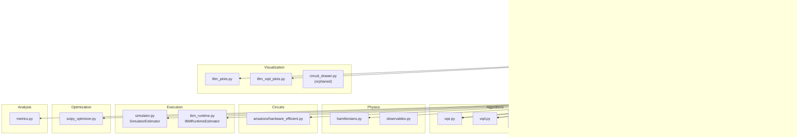

# Atlas Architecture Design Review: Hamiltonian Simulation Integration

> **Status: HISTORICAL / SUPERSEDED**  
> This document captured a pre-implementation design review. Hamiltonian
> simulation is now wired end-to-end (`HamiltonianSimExperiment`, product
> formulas, evolver, sim plots, lattice dashboard, YAML configs).  
> Treat the sections below as design history, not as a description of the
> current codebase. For the live architecture, see
> [`architecture_analysis.md`](architecture_analysis.md) and
> [`atlas_component_extension_guide.md`](atlas_component_extension_guide.md).

This document is based on the codebase as of the original review date. It distinguishes **observations** (what existed then) from **proposals** (what should be built). No implementation is included in this file.

---

## Executive Summary

Atlas is a well-layered, YAML-driven quantum simulation framework with a clean separation between **physics**, **circuits**, **algorithms**, **execution**, and **experiments**. The variational core (`VQE`, `VQD`) is genuinely algorithm-agnostic. The experiment orchestration layer, however, is tightly bound to **TFIM + VQE/VQD**: the factory always constructs `TFIMExperiment`, config always requires ansatz/optimizer, and outputs are dispatched on TFIM-specific result types.

A minimal Hamiltonian simulation stub already exists (`algorithms/hamiltonian_sim.py`) with the right high-level shape—`EvolutionMethod` builds a circuit, a backend executes it—but it is **not wired** into the pipeline, has no evolution method implementations, no circuit-execution backend, no experiment class, and an incomplete `HamiltonianSimResult` in `results.py`.

**Recommendation:** Integrate Hamiltonian Simulation by extending existing boundaries rather than mirroring the VQE pipeline wholesale. Product-formula circuit construction belongs in `circuits/`; orchestration in `algorithms/`; circuit execution in `execution/`; TFIM-specific benchmarking in a new or extended experiment module; passive analysis and visualization reuse `analysis/` patterns. A small set of **mandatory refactors** (factory decoupling, conditional config, execution abstraction) should precede implementation.

---

# Part 1 — Current Architecture Analysis

## Package-Level Overview



---

## Module-by-Module Analysis

### `algorithms/`

| Module | Responsibility | Consumes | Produces | Dependents | Agnostic? |
|--------|---------------|----------|----------|------------|-----------|
| `vqe.py` | Multi-start variational energy minimization | `estimator`, `optimizer`, `hamiltonian`, `ansatz` | `VQEResult` | `builders`, `vqd`, `tfim` | **Yes** — duck-typed Hamiltonian/ansatz |
| `vqd.py` | Sequential deflation on top of VQE | Wrapped `VQE`, `hamiltonian`, `ansatz` | `VQDResult` | `builders`, `tfim` | **VQD-specific**, but Hamiltonian/ansatz agnostic |
| `hamiltonian_sim.py` | Time-evolution orchestration (stub) | `evolution_method`, `backend`, `hamiltonian`, `initial_state`, `evolution_time` | Raw backend result (untyped) | None | **Yes** (stub, unwired) |

**Key design win:** `VQE` never imports TFIM, hardware, or plotting code. This is the pattern Hamiltonian Simulation should follow.

---

### `experiments/`

| Module | Responsibility | Consumes | Produces | Dependents | Agnostic? |
|--------|---------------|----------|----------|------------|-----------|
| `builders.py` | Config → runtime components | `AtlasConfig` | Hamiltonian, ansatz, optimizer, estimator, algorithm, observables | `factory`, `tfim` | **No** — only `tfim`, `vqe`/`vqd`, `hardware_efficient`, `scipy`, `statevector` |
| `factory.py` | Experiment assembly + run dispatch | `AtlasConfig` | `ExperimentRunResult` | `main` | **No** — always returns `TFIMExperiment` |
| `tfim.py` | TFIM workflow: exact ref + algorithm + metrics + optional hardware | `AtlasConfig`, injected algorithm, `(J,h)` | `TFIMPointResult`, `TFIMBenchmarkResult`, VQD variants | `factory` | **No** — TFIM + VQE/VQD |
| `results.py` | Structured result dataclasses | Numeric/array data from runs | `VQEResult`, `VQDResult`, `TFIM*`, `HardwareEvaluationResult`, `HamiltonianSimResult` (incomplete) | algorithms, tfim, outputs, viz, io | **Mixed** — algorithm results agnostic; TFIM wrappers system-specific |
| `outputs.py` | CSV, plots, console summaries | `ExperimentRunResult` | Files under timestamped run dir | `main` | **No** — dispatches on TFIM result types only |

---

### `execution/`

| Module | Responsibility | Consumes | Produces | Dependents | Agnostic? |
|--------|---------------|----------|----------|------------|-----------|
| `simulator.py` | Local statevector **estimator** for VQE cost | Parameterized circuit, `SparsePauliOp`, param values | `float` expectation; `Statevector` | `builders`, `vqe`, `vqd` | **Yes** — but estimator-shaped, not executor-shaped |
| `ibm_runtime.py` | Post-optimization hardware **estimator** | Bound ansatz, Hamiltonian, observables | `HardwareEvaluationResult` | `tfim` | **Yes** (interface); hardware-specific impl |

**Gap:** No `execute(circuit) → Statevector` abstraction exists, which Hamiltonian Simulation requires.

---

### `optimization/`

| Module | Responsibility | Consumes | Produces | Dependents | Agnostic? |
|--------|---------------|----------|----------|------------|-----------|
| `scipy_optimizer.py` | SciPy `minimize` wrapper | `cost_fn`, `initial_point` | `OptimizerRunResult` | `builders`, `vqe` | **Fully agnostic** |

Not needed for Hamiltonian Simulation (no classical optimization loop).

---

### `physics/`

| Module | Responsibility | Consumes | Produces | Dependents | Agnostic? |
|--------|---------------|----------|----------|------------|-----------|
| `hamiltonians.py` | Physical models → `SparsePauliOp` | Model parameters, `num_qubits` | `Hamiltonian.operator()`, `ExactResult` via dense diagonalization | `builders`, algorithms, `ibm_runtime` | **ABC generic**; only `TFIMHamiltonian` implemented |
| `observables.py` | Named measurement operators | `num_qubits` | `list[ObservableSpec]` | `builders`, `tfim`, `metrics`, `ibm_runtime` | **Spec generic**; only `tfim_observables()` factory |

**Reusable for Hamiltonian Simulation:** `Hamiltonian.operator()`, `ObservableSpec`, exact diagonalization for small-system reference.

**Missing:** Exact time-evolved state \(e^{-iHt}|\psi_0\rangle\) — not implemented anywhere.

---

### `circuits/`

| Module | Responsibility | Consumes | Produces | Dependents | Agnostic? |
|--------|---------------|----------|----------|------------|-----------|
| `ansatzes/hardware_efficient.py` | Variational ansatz construction | `num_qubits`, `reps` | `AnsatzSpec` (circuit + `ParameterVector` + `bind()`) | `builders`, `vqe`, `vqd`, `tfim`, `ibm_runtime` | **Ansatz-agnostic pattern**; only one ansatz |

**Gap:** No product-formula / Trotter circuit builders exist. This is the natural home for them.

---

### `analysis/`

| Module | Responsibility | Consumes | Produces | Dependents | Agnostic? |
|--------|---------------|----------|----------|------------|-----------|
| `metrics.py` | Pure post-processing | `Statevector`/bound circuit, observables, reference values | Fidelity, expectation dict, error metrics | `tfim`, `csv_io` | **Fully agnostic** |

Directly reusable for evolved-state fidelity and observable computation.

---

### `visualization/`

| Module | Responsibility | Consumes | Produces | Dependents | Agnostic? |
|--------|---------------|----------|----------|------------|-----------|
| `tfim_plots.py` | VQE benchmark/single-point plots | `TFIMBenchmarkResult`, `TFIMPointResult` | PNG files | `outputs` | **VQE + TFIM specific** |
| `tfim_vqd_plots.py` | VQD plots | `TFIMVQD*Result` | PNG files | `outputs` | **VQD + TFIM specific** |
| `circuit_drawer.py` | Qiskit circuit rendering | `QuantumCircuit` | Image file | None (orphaned) | **Generic** |

---

### `io/`

| Module | Responsibility | Consumes | Produces | Dependents | Agnostic? |
|--------|---------------|----------|----------|------------|-----------|
| `yaml_config.py` | YAML → `AtlasConfig` with validation | YAML file path | `AtlasConfig` | `main` | **Schema generic**; supported-name sets are VQE/VQD/TFIM only |
| `csv_io.py` | VQE benchmark CSV I/O | `TFIMBenchmarkResult` | CSV file; `DataFrame` for hardware merge | `outputs`, `tfim` | **VQE + TFIM specific** |

---

### `config/` (file: `atlas/config.py`)

There is no `config/` package; configuration lives in a single module.

| Dataclass | Responsibility | VQE/VQD coupling |
|-----------|---------------|------------------|
| `AtlasConfig` | Top-level YAML container | Requires `algorithm`, `ansatz`, `optimizer`, `backend` for all experiments |
| `SystemConfig` | Physical system selection | Only `tfim` supported |
| `AlgorithmConfig` | Algorithm name + params | Only `vqe`/`vqd` |
| `AnsatzConfig` | Circuit family | Only `hardware_efficient` — **not needed for Hamiltonian Simulation** |
| `OptimizerSettingsConfig` | Classical optimizer | Only `scipy` — **not needed for Hamiltonian Simulation** |
| `BackendConfig` | Cost-evaluation backend | Only `statevector` — semantically wrong for dynamics |
| `AnalysisConfig` | Post-run analysis toggles | `tfim_default` observables |
| `HardwareConfig` | IBM Runtime settings | Estimator-oriented |
| `OutputConfig` | Output directory and toggles | Generic |

---

## Dependency / Data-Flow Diagram (Current)

```text
┌─────────────────────────────────────────────────────────────────────────────┐
│                              USER / CLI                                      │
│                    python -m atlas.main --config <yaml>                      │
└──────────────────────────────────┬──────────────────────────────────────────┘
                                   │
                    ┌──────────────▼──────────────┐
                    │   io/yaml_config.load_config │
                    │   → AtlasConfig              │
                    └──────────────┬──────────────┘
                                   │
                    ┌──────────────▼──────────────┐
                    │   experiments/factory          │
                    │   build_experiment()           │
                    │   ConfiguredExperimentRunner   │
                    └──────────────┬──────────────┘
                                   │
          ┌────────────────────────┼────────────────────────┐
          │                        │                        │
┌─────────▼─────────┐  ┌──────────▼──────────┐  ┌─────────▼─────────┐
│ experiments/       │  │ experiments/         │  │ experiments/       │
│ builders.py        │  │ tfim.py              │  │ results.py         │
│                    │  │ TFIMExperiment       │  │ TFIMPointResult    │
│ TFIMHamiltonian    │  │                      │  │ TFIMBenchmarkResult│
│ AnsatzSpec         │  │ per (J,h) point:     │  │ VQEResult          │
│ ScipyOptimizer     │  │  exact ref           │  │ VQDResult          │
│ SimulatorEstimator │  │  algorithm.run()     │  │ HardwareEvalResult │
│ VQE / VQD          │  │  fidelity/observables│  │                    │
└─────────┬─────────┘  │  optional hardware   │  └─────────┬─────────┘
          │            └──────────┬───────────┘            │
          │                       │                        │
┌─────────▼─────────┐  ┌──────────▼──────────┐            │
│ physics/          │  │ algorithms/          │            │
│ hamiltonians      │  │ vqe / vqd            │            │
│ observables       │  │                      │            │
└───────────────────┘  │ execution/simulator  │            │
                       │ (estimator loop)     │            │
                       └──────────────────────┘            │
                                   │                        │
                    ┌──────────────▼──────────────┐         │
                    │   experiments/outputs      │◄────────┘
                    │   save_outputs()             │
                    │   → io/csv_io                │
                    │   → visualization/tfim_*     │
                    └─────────────────────────────┘
```

---

# Part 2 — Current VQE Experiment Pipeline

## End-to-End Flow

```text
YAML file
  │
  ▼
load_config(path)                          [io/yaml_config.py]
  │  validates: experiment, system, algorithm, ansatz, optimizer,
  │              backend, hardware, analysis, output
  ▼
AtlasConfig                                [config.py]
  │
  ▼
run_experiment(config)                     [experiments/factory.py]
  │
  ├─ build_estimator(config)               → SimulatorEstimator
  ├─ build_optimizer(config)               → ScipyOptimizer
  ├─ build_algorithm(config, ...)          → VQE (or VQD wrapping VQE)
  └─ TFIMExperiment(config, algorithm)
  │
  ▼
ConfiguredExperimentRunner.run()
  │  dispatches on experiment.type (single_point | sweep)
  │  dispatches on algorithm.name (vqe | vqd)
  │  resolves hardware backend if enabled
  ▼
TFIMExperiment.run_single_point(J, h)      [experiments/tfim.py]
  │
  ├─ _build_point_context(J, h)
  │     ├─ build_hamiltonian()             → TFIMHamiltonian(J, h, num_qubits)
  │     ├─ build_ansatz()                  → AnsatzSpec
  │     └─ build_observables()             → list[ObservableSpec]
  │
  ├─ hamiltonian.exact_ground_state()      → ExactResult(energy, statevector)
  │
  ├─ algorithm.run(hamiltonian, ansatz)    → VQEResult
  │     └─ VQE.run():
  │           operator = hamiltonian.operator()     → SparsePauliOp
  │           cost_fn(θ) = estimator.expectation(
  │               ansatz.circuit, operator, θ)      → float
  │           optimizer.minimize(cost_fn, θ₀)       → OptimizerRunResult
  │           (multi-start loop)                    → VQEResult
  │
  ├─ Post-processing:
  │     bound_circuit = ansatz.bind(optimal_parameters)
  │     vqe_state = Statevector(bound_circuit)
  │     fidelity = state_fidelity_to_exact(vqe_state, exact_state)
  │     observables = expectation_values(vqe_state, observables)
  │
  ├─ Optional hardware:
  │     IBMRuntimeEstimator.evaluate(ansatz, hamiltonian, params, observables)
  │     → HardwareEvaluationResult
  │
  └─ TFIMPointResult
  │
  ▼
ExperimentRunResult(config, result, experiment_type, algorithm_name)
  │
  ▼
save_outputs(run)                          [experiments/outputs.py]
  │  isinstance dispatch → VQE CSV/plots/console
  └─ atlas/data/{name}_{timestamp}/
```

## Objects Passed Between Stages

| Stage transition | Object type | Key fields |
|-----------------|-------------|------------|
| YAML → Config | `AtlasConfig` | All section dataclasses |
| Config → Builders | `AtlasConfig` | Unchanged |
| Builder → Factory | `SimulatorEstimator`, `ScipyOptimizer`, `VQE`/`VQD` | Wired instances |
| Factory → Experiment | `TFIMExperiment` | `config`, `algorithm` |
| Point context | `TFIMHamiltonian`, `AnsatzSpec`, `list[ObservableSpec]` | Per `(J,h)` |
| Exact reference | `ExactResult` | `energy`, `statevector` |
| Algorithm output | `VQEResult` | `energy`, `optimal_parameters`, `nfev`, ... |
| Experiment output | `TFIMPointResult` | Exact + VQE + fidelity + observables + optional hardware |
| Run wrapper | `ExperimentRunResult` | `config`, `result`, metadata |
| Output phase | Same result objects | Read-only consumption |

## VQE-Specific Assumptions in the Pipeline

| Location | Assumption | Impact on Hamiltonian Simulation |
|----------|-----------|-------------------------------|
| `yaml_config._SUPPORTED` | Only `vqe`/`vqd` algorithms | Blocks `hamiltonian_sim` config |
| `yaml_config._REQUIRED_SECTIONS` | `ansatz`, `optimizer` always required | Irrelevant sections forced for dynamics |
| `builders.build_algorithm` | Always constructs VQE path | No dynamics algorithm builder |
| `builders.build_estimator` | Expectation-value estimator | Wrong abstraction for circuit execution |
| `factory.build_experiment` | Return type `TFIMExperiment` | No dynamics experiment |
| `ConfiguredExperimentRunner` | VQE/VQD method dispatch | No evolution dispatch |
| `tfim.py` | Requires ansatz; calls `algorithm.run(h, ansatz)` | Evolution needs `run(h, initial_state, t)` |
| `tfim.py` | Exact ground state as reference | Evolution needs exact \(e^{-iHt}\|\psi_0\rangle\) |
| `results.py` | `TFIMPointResult` embeds `VQEResult` | Needs evolution-specific result type |
| `outputs.py` | `isinstance` on TFIM types | No evolution output path |
| `ibm_runtime.py` | EstimatorV2 + ansatz binding | Hardware evolution needs Sampler or state tomography |

---

# Part 3 — Hamiltonian Simulation Requirements

## What Hamiltonian Simulation Fundamentally Requires

### Required Inputs

| Input | Description | Exists in Atlas? |
|-------|-------------|------------------|
| Hamiltonian operator \(H\) | `SparsePauliOp` from Pauli decomposition | **Yes** — `Hamiltonian.operator()` |
| System size | `num_qubits` | **Yes** |
| Initial state \(\|\psi_0\rangle\) | Product state, computational basis, or explicit statevector | **No** — no `InitialState` abstraction |
| Evolution time \(t\) | Scalar (or schedule for time-dependent H) | **No** — no config field |
| Evolution method | Product formula order, Trotter steps | **No** — no implementations |
| Execution backend | Runs full circuit, returns final state | **Partial** — `SimulatorEstimator.statevector()` exists but no executor interface |
| Observables (optional) | Post-evolution measurements | **Yes** — `ObservableSpec` + `expectation_values()` |
| Reference solution (benchmark) | Exact \(e^{-iHt}\|\psi_0\rangle\) for small systems | **No** |

### Required Outputs

| Output | Description | Exists? |
|--------|-------------|---------|
| Evolved statevector | Final \(\|\psi(t)\rangle\) | **No** typed result |
| Circuit metadata | Depth, gate count, Trotter steps | **No** |
| Fidelity vs exact | \(\|\langle\psi_\text{exact}(t)\|\psi_\text{sim}(t)\rangle\|^2\) | **Metric exists**, reference missing |
| Observable expectations | \(\langle O_i \rangle\) on evolved state | **Yes** — `expectation_values()` |
| Error vs exact observables | Per-observable error | **Yes** — `absolute_error()` |
| Sweep collections | Over \(t\), \(h\), or Trotter steps | **Pattern exists** in `TFIMBenchmarkResult` |

### Internal Responsibilities (by concern)

| Concern | Responsibility | Natural owner |
|---------|---------------|---------------|
| **Algorithm-specific** | Orchestrate: build circuit → execute → package result | `algorithms/hamiltonian_sim.py` |
| **Evolution method** | Decompose \(e^{-iHt}\) into gate sequence | `circuits/evolution/` (new) |
| **Hamiltonian-specific** | Pauli term extraction, term grouping | `physics/hamiltonians.py` (reuse `operator()`) |
| **Backend-specific** | Statevector sim, shot-based, IBM hardware | `execution/` (new executor) |
| **Experiment-specific** | Compose per-point context, exact reference, sweeps | `experiments/` (new or extended) |
| **Analysis** | Fidelity, observable errors | `analysis/metrics.py` (reuse + extend) |
| **I/O / visualization** | CSV, plots over time/steps | `io/`, `visualization/` (new modules) |

### Components Already Reusable

| Component | Reuse for Hamiltonian Simulation |
|-----------|----------------------------------|
| `Hamiltonian` ABC + `TFIMHamiltonian` | Direct — provides `operator()` |
| `ObservableSpec` + `tfim_observables()` | Direct — post-evolution measurements |
| `analysis/metrics.py` | Direct — fidelity, expectation values, errors |
| `SimulatorEstimator.statevector()` | Partial — can compute final state from bound circuit |
| `ExperimentRunResult` pattern | Pattern — wrap config + typed result |
| Sweep infrastructure in `factory.py` | Pattern — generalize parameter name |
| `resolve_run_output_dir()` | Direct |
| `HamiltonianSimulation` stub | Starting point — correct orchestration shape |

### Components That Should **Not** Be Reused (for dynamics)

| Component | Why not |
|-----------|---------|
| `VQE` / `ScipyOptimizer` | No optimization loop |
| `AnsatzSpec` / `build_ansatz()` | Evolution circuits are deterministic, not variational |
| `SimulatorEstimator.expectation()` | Cost-evaluation primitive, not full-circuit execution |
| `IBMRuntimeEstimator` | EstimatorV2 for bound ansatz — wrong primitive for evolution |
| `TFIMPointResult` | Embeds `VQEResult`; wrong semantics |

---

# Part 4 — Proposed Architecture

## Design Principles

1. **Do not mirror VQE** — Hamiltonian Simulation has no optimizer, no ansatz, no estimator loop.
2. **Reuse the stub's shape** — `EvolutionMethod.build_circuit()` + `Executor.execute()` is correct.
3. **Place circuit construction in `circuits/`** — parallel to `ansatzes/`, not inside the algorithm.
4. **Keep algorithms thin** — orchestration only; no Qiskit primitive details.
5. **Introduce abstractions only where multiple implementations are planned** — product formulas now; QDrift/LCU later.

## Proposed Component Catalog

### Layer 1: Physics (reuse + small extension)

#### `Hamiltonian` (existing)
- **Module:** `atlas/physics/hamiltonians.py`
- **Interface:** `operator() → SparsePauliOp`, `num_qubits`
- **Change:** None required for basic simulation

#### `exact_time_evolution()` (new function)
- **Module:** `atlas/physics/hamiltonians.py` or `atlas/analysis/exact_dynamics.py`
- **Interface:**
  ```python
  def exact_time_evolution(
      hamiltonian: Hamiltonian,
      initial_state: np.ndarray,
      time: float,
  ) -> ExactResult
  ```
- **Responsibility:** Compute \(e^{-iHt}|\psi_0\rangle\) via `scipy.linalg.expm` for small systems
- **Dependencies:** `Hamiltonian.operator().to_matrix()`, numpy/scipy
- **Returns:** `ExactResult(energy=⟨H⟩, statevector=evolved_state)` or a new `EvolvedStateResult`
- **Justification:** Exact ground state already lives on `Hamiltonian`; time evolution is the dynamics analogue. Placing it in `analysis/` keeps `physics/` free of time-dependent logic; placing it on `Hamiltonian` mirrors `exact_ground_state()`. **Recommend:** method on `Hamiltonian` base class alongside `exact_ground_state()` for consistency.

---

### Layer 2: Circuits (new package)

#### `InitialStateSpec` (new dataclass)
- **Module:** `atlas/circuits/initial_states.py`
- **Interface:**
  ```python
  @dataclass
  class InitialStateSpec:
      num_qubits: int
      def prepare_circuit(self) -> QuantumCircuit: ...
      def statevector(self) -> np.ndarray: ...
  ```
- **Implementations:** `ComputationalBasisState("|01...>")`, `UniformSuperpositionState`, `CustomStatevectorState`
- **Justification:** Evolution needs state preparation distinct from variational ansätze. Parallel to `AnsatzSpec` but without parameters.

#### `EvolutionMethod` (new ABC)
- **Module:** `atlas/circuits/evolution/base.py`
- **Interface:**
  ```python
  class EvolutionMethod(ABC):
      @property
      def name(self) -> str: ...
      @property
      def order(self) -> int: ...  # Trotter order
      
      def build_circuit(
          self,
          hamiltonian: Hamiltonian,
          initial_state: InitialStateSpec,
          evolution_time: float,
      ) -> EvolutionCircuitSpec: ...
  ```
- **Justification:** Product formulas are **circuit construction**, not algorithm orchestration. Mirrors how `build_hardware_efficient_ansatz()` lives in `circuits/`, not `algorithms/`.

#### `EvolutionCircuitSpec` (new dataclass)
- **Module:** `atlas/circuits/evolution/base.py`
- **Fields:** `circuit: QuantumCircuit`, `num_qubits: int`, `num_trotter_steps: int`, `evolution_time: float`, `method_name: str`, `circuit_depth: int`
- **Justification:** Like `AnsatzSpec` bundles circuit + metadata, but for deterministic evolution circuits.

#### `LieTrotter`, `StrangTrotter`, `Suzuki2` (new implementations)
- **Module:** `atlas/circuits/evolution/product_formulas.py`
- **Responsibility:** Pauli-term circuit synthesis, Trotter step repetition
- **Dependencies:** `Hamiltonian.operator()`, Qiskit `PauliEvolutionGate` or manual Rz/CX decomposition
- **Returns:** `EvolutionCircuitSpec`
- **Justification:** README roadmap explicitly names Trotter-Suzuki. Each formula is a separate class implementing `EvolutionMethod`.

---

### Layer 3: Execution (extend)

#### `CircuitExecutor` (new ABC)
- **Module:** `atlas/execution/base.py` or `atlas/execution/executor.py`
- **Interface:**
  ```python
  class CircuitExecutor(ABC):
      def execute(self, circuit: QuantumCircuit) -> ExecutionResult: ...
  
  @dataclass
  class ExecutionResult:
      statevector: np.ndarray
      num_qubits: int
  ```
- **Justification:** Separates "run a circuit once" from "evaluate expectation in a loop." VQE needs `Estimator`; dynamics needs `Executor`.

#### `StatevectorExecutor` (new)
- **Module:** `atlas/execution/simulator.py` (extend existing file)
- **Interface:** `execute(circuit) → ExecutionResult` using `Statevector(circuit)`
- **Dependencies:** Qiskit `Statevector`
- **Justification:** Co-locate with `SimulatorEstimator`; same backend, different primitive.

#### `IBMRuntimeSampler` (future, optional)
- **Module:** `atlas/execution/ibm_runtime.py` (extend)
- **Responsibility:** Hardware execution of evolution circuits via `SamplerV2`
- **Not required for initial implementation**

---

### Layer 4: Algorithms (extend existing stub)

#### `HamiltonianSimulation` (refine existing)
- **Module:** `atlas/algorithms/hamiltonian_sim.py`
- **Public interface:**
  ```python
  class HamiltonianSimulation:
      def __init__(self, evolution_method: EvolutionMethod, executor: CircuitExecutor): ...
      
      def run(
          self,
          hamiltonian: Hamiltonian,
          initial_state: InitialStateSpec,
          evolution_time: float,
      ) -> SimulationResult: ...
  ```
- **Responsibility:** Build circuit via evolution method, execute via executor, return typed result
- **Dependencies:** `EvolutionMethod`, `CircuitExecutor`, `Hamiltonian`, `InitialStateSpec`
- **Returns:** `SimulationResult` (algorithm-level, not experiment-level)
- **Justification:** Matches existing stub; adds typing and removes raw backend return.

#### `SimulationResult` (new dataclass)
- **Module:** `atlas/experiments/results.py`
- **Fields:**
  ```python
  @dataclass
  class SimulationResult:
      statevector: np.ndarray
      num_qubits: int
      evolution_time: float
      method_name: str
      num_trotter_steps: int
      circuit_depth: int
  ```
- **Justification:** Algorithm-level result, parallel to `VQEResult`. No TFIM-specific fields.

---

### Layer 5: Experiments (new module)

#### `HamiltonianSimExperiment` (new — recommended over extending TFIMExperiment)
- **Module:** `atlas/experiments/hamiltonian_sim_experiment.py`
- **Public interface:**
  ```python
  class HamiltonianSimExperiment:
      def __init__(self, config: AtlasConfig, algorithm: HamiltonianSimulation): ...
      
      def run_single_point(self, J, h, evolution_time, ...) -> SimPointResult: ...
      def run_time_sweep(self, J, h, time_values, ...) -> SimBenchmarkResult: ...
      def run_parameter_sweep(self, J, param_values, evolution_time, ...) -> SimBenchmarkResult: ...
  ```
- **Responsibility:**
  - Build per-point Hamiltonian, initial state, observables via builders
  - Compute exact evolved reference
  - Call `algorithm.run()`
  - Compute fidelity and observable expectations
- **Dependencies:** builders (extended), `HamiltonianSimulation`, `analysis/metrics`
- **Returns:** `SimPointResult`, `SimBenchmarkResult` (names below)

**Justification for separate experiment class (not extending `TFIMExperiment`):**
- Different per-point context (no ansatz)
- Different algorithm signature
- Different reference solution (time evolution, not ground state)
- Different sweep axes (time, Trotter steps, not just `h`)
- Keeps `TFIMExperiment` focused; avoids a god-class

#### `SimPointResult` (new)
- **Module:** `atlas/experiments/results.py`
- **Fields:** `h`, `J`, `num_qubits`, `evolution_time`, `num_trotter_steps`, `exact_state`, `sim_result: SimulationResult`, `fidelity`, `observables: dict`, `observable_errors: dict`

#### `SimBenchmarkResult` (new)
- **Module:** `atlas/experiments/results.py`
- **Fields:** `points: list[SimPointResult]` with sweep accessors (mirror `TFIMBenchmarkResult` pattern)

---

### Layer 6: Builders (extend)

| New builder | Module | Returns |
|-------------|--------|---------|
| `build_initial_state(config, num_qubits)` | `experiments/builders.py` | `InitialStateSpec` |
| `build_evolution_method(config)` | `experiments/builders.py` | `EvolutionMethod` |
| `build_executor(config)` | `experiments/builders.py` | `CircuitExecutor` |
| `build_hamiltonian_sim(config, executor, evolution_method)` | `experiments/builders.py` | `HamiltonianSimulation` |

Refactor `build_algorithm()` to dispatch:
```python
if config.algorithm.name in ("vqe", "vqd"):
    return build_variational_algorithm(...)
elif config.algorithm.name == "hamiltonian_sim":
    return build_hamiltonian_sim(...)
```

---

### Layer 7: Factory (refactor)

```python
def build_experiment(config: AtlasConfig):
    if config.algorithm.name in ("vqe", "vqd"):
        return _build_variational_experiment(config)
    elif config.algorithm.name == "hamiltonian_sim":
        return _build_hamiltonian_sim_experiment(config)
    raise ValueError(...)
```

`ConfiguredExperimentRunner` gains evolution dispatch paths and generalized sweep parameter support.

---

### Layer 8: Config (extend)

New/optional sections:

```yaml
algorithm:
  name: hamiltonian_sim
  parameters:
    evolution_method: strang          # lie | strang | suzuki2
    num_trotter_steps: 10

initial_state:
  name: computational
  parameters:
    bitstring: "0" * num_qubits     # or "all_plus"

# ansatz: (omitted or null for hamiltonian_sim)
# optimizer: (omitted or null for hamiltonian_sim)

backend:
  name: statevector_executor        # new backend name

system:
  sweep:
    parameter: evolution_time       # generalize beyond "h"
    values: [0.1, 0.5, 1.0, 2.0]
```

**Config schema change:** Make `ansatz` and `optimizer` conditionally required based on algorithm category.

---

### Layer 9: Analysis, I/O, Visualization (new modules)

| Component | Module | Responsibility |
|-----------|--------|---------------|
| `evolution_fidelity()` | `analysis/metrics.py` | Wrapper around `state_fidelity_to_exact` for evolved states |
| `write_sim_benchmark()` | `io/csv_io.py` | CSV for time-sweep results |
| `plot_fidelity_vs_time()` | `visualization/sim_plots.py` | Fidelity vs evolution time |
| `plot_observable_vs_time()` | `visualization/sim_plots.py` | Observable tracking over time |
| `plot_trotter_convergence()` | `visualization/sim_plots.py` | Error vs Trotter steps |
| Dispatch in `outputs.py` | `experiments/outputs.py` | `isinstance` on `SimPointResult` / `SimBenchmarkResult` |

---

## Component Placement Summary

| Component | Package | Why |
|-----------|---------|-----|
| `EvolutionMethod`, `LieTrotter`, `Strang`, `Suzuki` | `circuits/evolution/` | Circuit construction, parallel to ansätze |
| `InitialStateSpec` | `circuits/initial_states.py` | State preparation circuits |
| `HamiltonianSimulation` | `algorithms/` | Algorithm orchestration (thin) |
| `SimulationResult` | `experiments/results.py` | Shared result types (existing convention) |
| `CircuitExecutor`, `StatevectorExecutor` | `execution/` | Backend primitives |
| `HamiltonianSimExperiment` | `experiments/` | Workflow composition |
| `exact_time_evolution()` | `physics/hamiltonians.py` | Reference solver, mirrors `exact_ground_state()` |
| Plots, CSV | `visualization/`, `io/` | Passive consumers |

---

# Part 5 — End-to-End Data Flow (Hamiltonian Simulation)

```text
configs/tfim_hamiltonian_sim.yaml
  │
  ▼
load_config(path)                              [io/yaml_config.py]
  │  validates algorithm=hamiltonian_sim
  │  ansatz/optimizer optional or absent
  │  validates evolution_method, initial_state, backend=statevector_executor
  ▼
AtlasConfig                                    [config.py]
  │  + evolution params in algorithm.parameters
  │  + initial_state section (new)
  ▼
run_experiment(config)                         [experiments/factory.py]
  │
  ├─ build_evolution_method(config)            → StrangTrotter(num_steps=10)
  ├─ build_executor(config)                  → StatevectorExecutor
  ├─ build_hamiltonian_sim(config, ...)        → HamiltonianSimulation
  └─ HamiltonianSimExperiment(config, algorithm)
  │
  ▼
ConfiguredExperimentRunner.run()
  │  experiment.type == single_point → run_single_point(J, h, t)
  │  experiment.type == sweep → run_time_sweep(J, h, time_values)
  ▼
HamiltonianSimExperiment.run_single_point(J, h, evolution_time)
  │  OWNER: experiments/hamiltonian_sim_experiment.py
  │
  ├─ build_hamiltonian(config, {J, h})         → TFIMHamiltonian
  ├─ build_initial_state(config, num_qubits)   → InitialStateSpec
  ├─ build_observables(config, num_qubits)     → list[ObservableSpec]
  │
  ├─ exact_time_evolution(ham, |ψ₀⟩, t)        → ExactResult
  │     OWNER: physics/hamiltonians.py
  │
  ├─ algorithm.run(ham, initial_state, t)      → SimulationResult
  │     OWNER: algorithms/hamiltonian_sim.py
  │     │
  │     ├─ evolution_method.build_circuit()  → EvolutionCircuitSpec
  │     │     OWNER: circuits/evolution/strang.py
  │     │
  │     └─ executor.execute(circuit)           → ExecutionResult
  │           OWNER: execution/simulator.py (StatevectorExecutor)
  │
  ├─ fidelity = state_fidelity_to_exact(sim, exact)
  ├─ observables = expectation_values(sim_state, observables)
  ├─ errors = {name: absolute_error(exact, sim) for ...}
  │
  └─ SimPointResult                            [experiments/results.py]
  │
  ▼
ExperimentRunResult(config, result, "single_point", "hamiltonian_sim")
  │
  ▼
save_outputs(run)                              [experiments/outputs.py]
  ├─ plot_fidelity_vs_time / plot_observable_vs_time
  ├─ write_sim_benchmark (if sweep)
  └─ console summary
  │
  └─ atlas/data/{name}_{timestamp}/
```

## Stage Ownership Table

| Stage | Owner module | Input type | Output type |
|-------|-------------|------------|-------------|
| Config load | `io/yaml_config.py` | YAML path | `AtlasConfig` |
| Component build | `experiments/builders.py` | `AtlasConfig` | `HamiltonianSimulation` + deps |
| Experiment build | `experiments/factory.py` | `AtlasConfig` | `HamiltonianSimExperiment` |
| Run dispatch | `experiments/factory.py` | `AtlasConfig` | `ExperimentRunResult` |
| Point workflow | `experiments/hamiltonian_sim_experiment.py` | `(J, h, t)` | `SimPointResult` |
| Exact reference | `physics/hamiltonians.py` | `H`, `\|ψ₀⟩`, `t` | `ExactResult` |
| Circuit build | `circuits/evolution/*.py` | `H`, `InitialStateSpec`, `t` | `EvolutionCircuitSpec` |
| Circuit execute | `execution/simulator.py` | `QuantumCircuit` | `ExecutionResult` |
| Algorithm orchestration | `algorithms/hamiltonian_sim.py` | `H`, `InitialStateSpec`, `t` | `SimulationResult` |
| Analysis | `analysis/metrics.py` | States, observables | Fidelity, expectations, errors |
| Output | `experiments/outputs.py` | `ExperimentRunResult` | Files + console |

---

# Part 6 — Interaction Diagram

```text
┌──────────────────────────────────────────────────────────────────┐
│                     HamiltonianSimExperiment                      │
│  (experiments/hamiltonian_sim_experiment.py)                       │
│                                                                   │
│  builds per-point: Hamiltonian + InitialState + Observables       │
│  computes exact reference + post-run metrics                      │
└────────────┬──────────────────────────────┬──────────────────────┘
             │                              │
             │ run(ham, init, t)            │ exact_time_evolution(ham, |ψ₀⟩, t)
             ▼                              ▼
┌────────────────────────┐       ┌────────────────────────┐
│  HamiltonianSimulation │       │  Hamiltonian (physics)  │
│  (algorithms/)         │       │  exact_ground_state()   │
│                        │       │  exact_time_evolution()│
│  orchestrates:         │       └────────────────────────┘
│  build → execute       │
└───────┬────────┬───────┘
        │        │
        │        │ execute(circuit)
        │        ▼
        │   ┌─────────────────────┐
        │   │  StatevectorExecutor │
        │   │  (execution/)        │
        │   │  → ExecutionResult   │
        │   └─────────────────────┘
        │
        │ build_circuit(ham, init, t)
        ▼
┌────────────────────────┐
│  EvolutionMethod        │
│  (circuits/evolution/)  │
│                        │
│  ┌──────────────────┐  │
│  │ LieTrotter       │  │
│  │ StrangTrotter    │  │
│  │ Suzuki2          │  │
│  └──────────────────┘  │
│                        │
│  → EvolutionCircuitSpec│
└────────────────────────┘
        ▲
        │ uses operator()
        │
┌────────────────────────┐
│  TFIMHamiltonian        │
│  (physics/)            │
│  operator() → SparsePauliOp
└────────────────────────┘

             SimulationResult
                    │
                    ▼
┌──────────────────────────────────────────────────────────────────┐
│  analysis/metrics.py                                              │
│  state_fidelity_to_exact() + expectation_values()                 │
└────────────────────────────┬─────────────────────────────────────┘
                             │
                             ▼
                      SimPointResult
                             │
                             ▼
┌──────────────────────────────────────────────────────────────────┐
│  experiments/outputs.py → visualization/sim_plots.py → io/csv_io │
└──────────────────────────────────────────────────────────────────┘
```

---

# Part 7 — Generalization Review

## Current Generalization Score

| Layer | Generalization | Notes |
|-------|---------------|-------|
| `algorithms/vqe.py` | ★★★★★ | Exemplary duck-typing |
| `algorithms/vqd.py` | ★★★★☆ | VQD-specific but composable |
| `physics/hamiltonians.py` | ★★★★☆ | ABC exists; one implementation |
| `circuits/ansatzes/` | ★★★☆☆ | Good pattern; one ansatz |
| `optimization/` | ★★★★★ | Fully generic |
| `execution/simulator.py` | ★★★☆☆ | Generic estimator; no executor |
| `analysis/metrics.py` | ★★★★★ | Fully generic |
| `experiments/builders.py` | ★★☆☆☆ | Hardcoded names |
| `experiments/factory.py` | ★☆☆☆☆ | Always TFIMExperiment |
| `experiments/tfim.py` | ★☆☆☆☆ | TFIM + VQE/VQD only |
| `experiments/outputs.py` | ★★☆☆☆ | TFIM result dispatch |
| `config.py` + `yaml_config.py` | ★★☆☆☆ | Variational assumptions baked in |
| `visualization/` | ★★☆☆☆ | TFIM-named modules |
| `io/csv_io.py` | ★★☆☆☆ | VQE benchmark only |

## VQE/VQD/TFIM Assumption Inventory

| # | Location | Assumption | Why it exists | Keep? | Generalization | Blocks Hamiltonian Sim? |
|---|----------|-----------|---------------|-------|----------------|------------------------|
| 1 | `factory.build_experiment()` | Always returns `TFIMExperiment` | TFIM was the first and only experiment | **No** | Dispatch by algorithm category or `experiment.name` | **Yes — mandatory** |
| 2 | `builders.build_algorithm()` | Only `vqe`/`vqd` | Only variational algorithms implemented | **No** | Add `hamiltonian_sim` branch | **Yes — mandatory** |
| 3 | `yaml_config._SUPPORTED["algorithm"]` | `{vqe, vqd}` | Validation whitelist | **No** | Add `hamiltonian_sim` | **Yes — mandatory** |
| 4 | `yaml_config._REQUIRED_SECTIONS` | `ansatz`, `optimizer` always required | VQE needs both | **No** | Conditional required sections | **Yes — mandatory** |
| 5 | `yaml_config._SUPPORTED["backend"]` | `{statevector}` = estimator | Named for VQE cost eval | **No** | Add `statevector_executor` or generalize semantics | **Yes — mandatory** |
| 6 | `builders.build_estimator()` | Estimator-only backend | VQE loop primitive | **No** | Add `build_executor()` | **Yes — mandatory** |
| 7 | `tfim.py` algorithm call | `algorithm.run(hamiltonian, ansatz)` | VQE signature | **Yes for VQE** | Separate experiment class for dynamics | **Yes — mandatory** |
| 8 | `tfim.py` exact reference | `exact_ground_state()` | VQE benchmarks ground state | **Yes for VQE** | `exact_time_evolution()` for dynamics | **Yes — mandatory** |
| 9 | `ConfiguredExperimentRunner._run_sweep()` | Only sweeps `h` | TFIM phase diagram convention | **Partially** | Generalize `sweep.parameter` | **No for single-point; yes for time sweeps** |
| 10 | `results.TFIMPointResult` | Embeds `VQEResult` | VQE result packaging | **Yes for VQE** | New `SimPointResult` | **Yes — mandatory** |
| 11 | `outputs.save_outputs()` | `isinstance` on TFIM types | Only known result types | **No** | Add sim result dispatch | **Yes — mandatory** |
| 12 | `ExperimentRunResult.result` Union | Only TFIM types | Type hint reflects reality | **No** | Extend Union | **Yes — mandatory** |
| 13 | `ibm_runtime.IBMRuntimeEstimator` | Requires `AnsatzSpec` | Post-VQE hardware validation | **Yes for VQE** | Future `Sampler` path for evolution | **No initially** |
| 14 | `csv_io.write_tfim_benchmark()` | VQE column schema | First benchmark format | **Yes for VQE** | New `write_sim_benchmark()` | **No initially** |
| 15 | `visualization/tfim_plots.py` | VQE energy/fidelity plots | First plot set | **Yes for VQE** | New `sim_plots.py` | **No initially** |
| 16 | `config.AnalysisConfig.observables` | `tfim_default` only | One observable set | **Partially** | Reuse for sim; same observables on evolved state | **No** |
| 17 | `HamiltonianSimResult` in `results.py` | Incomplete stub; wrong fields (copied from hardware) | Premature stub | **No** | Replace with `SimulationResult` | **Yes — must fix before use** |
| 18 | `hamiltonian_sim.py` | Returns raw backend result | Unfinished | **No** | Return `SimulationResult` | **Yes — mandatory** |
| 19 | `builders.build_hamiltonian()` | Only `tfim` | One physical system | **Yes** | TFIM is fine for first sim benchmark | **No** |
| 20 | `analysis/metrics.py` docstring | Says "VQE results" | Legacy wording | **Yes** | Update docstring only | **No** |

---

# Part 8 — Required Refactors (Prioritized)

## Priority 1 — Mandatory (block implementation)

### R1: Algorithm-category dispatch in factory
| Field | Detail |
|-------|--------|
| **Affected files** | `experiments/factory.py`, `experiments/builders.py` |
| **Reason** | `build_experiment()` hardcodes `TFIMExperiment` and variational wiring |
| **Benefit** | Clean insertion point for `HamiltonianSimExperiment` |
| **Complexity** | Medium — split `build_experiment` into category-specific builders |
| **Mandatory** | **Yes** |

### R2: Conditional config schema
| Field | Detail |
|-------|--------|
| **Affected files** | `io/yaml_config.py`, `config.py` |
| **Reason** | `ansatz` and `optimizer` are required for all experiments; dynamics doesn't need them |
| **Benefit** | Valid YAML for Hamiltonian Simulation without dummy sections |
| **Complexity** | Medium — conditional validation based on `algorithm.name` |
| **Mandatory** | **Yes** |

### R3: Circuit execution abstraction
| Field | Detail |
|-------|--------|
| **Affected files** | `execution/simulator.py` (or new `execution/executor.py`), `experiments/builders.py` |
| **Reason** | Only `SimulatorEstimator.expectation()` exists; dynamics needs `execute(circuit)` |
| **Benefit** | Correct primitive separation; enables hardware sampler later |
| **Complexity** | Low — thin wrapper over `Statevector(circuit)` |
| **Mandatory** | **Yes** |

### R4: Fix and formalize result types
| Field | Detail |
|-------|--------|
| **Affected files** | `experiments/results.py`, `algorithms/hamiltonian_sim.py` |
| **Reason** | `HamiltonianSimResult` is incomplete (no `@dataclass`); stub returns untyped result |
| **Benefit** | Stable contract for experiment, analysis, I/O |
| **Complexity** | Low |
| **Mandatory** | **Yes** |

### R5: Exact time-evolution reference
| Field | Detail |
|-------|--------|
| **Affected files** | `physics/hamiltonians.py` |
| **Reason** | No reference solver for dynamics benchmarks |
| **Benefit** | Fidelity computation equivalent to `exact_ground_state()` for VQE |
| **Complexity** | Low — `scipy.linalg.expm(-1j * H * t) @ psi0` |
| **Mandatory** | **Yes** |

### R6: Separate dynamics experiment class
| Field | Detail |
|-------|--------|
| **Affected files** | New `experiments/hamiltonian_sim_experiment.py`, `experiments/factory.py` |
| **Reason** | `TFIMExperiment` is tightly coupled to ansatz + VQE/VQD signatures |
| **Benefit** | Avoids god-class; clean per-algorithm workflows |
| **Complexity** | Medium — mirrors `tfim.py` structure but simpler (no optimizer/hardware initially) |
| **Mandatory** | **Yes** |

---

## Priority 2 — Recommended (improve cleanliness)

### R7: Generalize sweep parameter
| Field | Detail |
|-------|--------|
| **Affected files** | `experiments/factory.py`, `config.py` |
| **Reason** | `parameter != "h"` raises `ValueError` |
| **Benefit** | Time sweeps, Trotter-step sweeps without another hardcoded branch |
| **Complexity** | Low–Medium |
| **Mandatory** | **No** (can hardcode `evolution_time` sweep initially) |

### R8: Split `builders.py` by algorithm category
| Field | Detail |
|-------|--------|
| **Affected files** | `experiments/builders.py` → `builders/variational.py`, `builders/dynamics.py` |
| **Reason** | File grows with each algorithm category |
| **Benefit** | Maintainability as algorithms accumulate |
| **Complexity** | Low (file split only) |
| **Mandatory** | **No** — defer until second non-variational algorithm |

### R9: Output dispatch registry
| Field | Detail |
|-------|--------|
| **Affected files** | `experiments/outputs.py` |
| **Reason** | Growing `isinstance` chain |
| **Benefit** | Cleaner extensibility for future result types |
| **Complexity** | Low |
| **Mandatory** | **No** — another `elif` branch is acceptable for now |

### R10: Extend `ExperimentRunResult.result` type union
| Field | Detail |
|-------|--------|
| **Affected files** | `experiments/factory.py` |
| **Reason** | Type hint doesn't include future result types |
| **Benefit** | Type safety |
| **Complexity** | Trivial |
| **Mandatory** | **No** but should accompany R6 |

---

## Priority 3 — Optional (future-proofing)

### R11: `InitialStateSpec` + config section
| Field | Detail |
|-------|--------|
| **Affected files** | New `circuits/initial_states.py`, `config.py`, `yaml_config.py` |
| **Reason** | Initial state is a first-class dynamics input |
| **Benefit** | Extensible to custom states, Hartree-Fock, etc. |
| **Complexity** | Low |
| **Mandatory** | **Optional** — can default to `\|0...0⟩` internally initially |

### R12: Hardware execution path for evolution
| Field | Detail |
|-------|--------|
| **Affected files** | `execution/ibm_runtime.py`, `hamiltonian_sim_experiment.py` |
| **Reason** | Current hardware path is EstimatorV2 + ansatz |
| **Benefit** | End-to-end hardware dynamics |
| **Complexity** | High |
| **Mandatory** | **No** — sim-only first |

### R13: Rename `backend` config section
| Field | Detail |
|-------|--------|
| **Affected files** | `config.py`, `yaml_config.py`, all configs |
| **Reason** | `backend` conflates estimator and executor semantics |
| **Benefit** | Clarity as execution primitives diversify |
| **Complexity** | Medium (breaking config change) |
| **Mandatory** | **No** — add new backend name instead |

---

## Recommended Implementation Order

```text
R3 (executor) → R4 (result types) → R5 (exact evolution)
    → R1 (factory dispatch) → R2 (conditional config)
    → R6 (experiment class) → [implement circuits/evolution]
    → R7 (sweep generalization) → output/plot modules
```

---

# Part 9 — Extensibility Analysis

## Future Algorithm Support Matrix

| Future algorithm | Fits proposed architecture? | Abstractions needed now | Notes |
|-----------------|---------------------------|------------------------|-------|
| **QDrift** | Yes | `EvolutionMethod` ABC with stochastic `build_circuit(seed)` | Different circuit each shot; executor may need shot-based interface later |
| **Randomized Product Formulas** | Yes | Same `EvolutionMethod`; random coefficients in `build_circuit` | Extends product_formulas.py |
| **Taylor Series Simulation** | Yes | New `TaylorEvolution` implementing `EvolutionMethod` | May need auxiliary qubits — extend `EvolutionCircuitSpec` with `num_ancilla` |
| **LCU** | Partially | **`HamiltonianSimulation` too narrow** — needs `SimulationAlgorithm` ABC | LCU requires block-encoding circuits, ancilla, measurement — different orchestration than product formulas |
| **Qubitization** | Partially | **`BlockEncoding` interface** in `circuits/encoding/` | Walk operator + signal state — distinct from Trotter |
| **QSP** | No (different problem) | **`SignalProcessingAlgorithm` ABC** in `algorithms/` | Polynomial transformation of block-encoded unitary — shares `circuits/encoding/` |
| **Phase Estimation** | Partially | **`EigenvalueAlgorithm` ABC** | Shares Hamiltonian + executor; different circuit (QFT + controlled-U) |
| **Time-dependent H(t)** | Yes with extension | **`TimeDependentHamiltonian`** with `operator(t)` | `EvolutionMethod.build_circuit(H, t0, t1, dt)` or `build_schedule()` |

## Abstractions to Introduce Now (avoid future redesign)

### 1. `EvolutionMethod` ABC (in `circuits/evolution/`)
Covers product formulas, QDrift, Taylor. Single method:
```python
build_circuit(hamiltonian, initial_state, evolution_time) -> EvolutionCircuitSpec
```
**Introduce now.** Even QDrift fits this interface (stochasticity handled via seed in parameters).

### 2. `CircuitExecutor` ABC (in `execution/`)
```python
execute(circuit) -> ExecutionResult
```
**Introduce now.** Shot-based backends can extend `ExecutionResult` with counts.

### 3. `SimulationResult` dataclass (in `results.py`)
**Introduce now.** Stable algorithm output contract.

### 4. `InitialStateSpec` (in `circuits/initial_states.py`)
**Introduce now.** Every dynamics algorithm needs it; cheap abstraction.

### 5. Algorithm category in factory dispatch
**Introduce now.** Variational vs dynamics vs eigenvalue categories.

## Abstractions to Defer

| Abstraction | Defer until |
|-------------|-------------|
| `BlockEncoding` | LCU or qubitization implementation begins |
| `SimulationAlgorithm` (broader than `HamiltonianSimulation`) | Second non-product-formula algorithm (LCU) |
| `ShotBasedExecutor` | Hardware or stochastic algorithm needs shots |
| Plugin registry for builders | 3+ implementations per component type |
| Time-dependent Hamiltonian interface | Time-dependent simulation requested |

## Proposed Evolution of `algorithms/` Package

```text
algorithms/
  vqe.py                          # variational (existing)
  vqd.py                          # variational (existing)
  hamiltonian_sim.py              # product-formula dynamics (proposed)
  qdrift.py                       # future: implements same run() signature
  lcu_simulation.py               # future: different signature, new ABC
  phase_estimation.py             # future: eigenvalue algorithm
```

The `HamiltonianSimulation.run(hamiltonian, initial_state, time)` signature is the right **product-formula family** contract. LCU/qubitization will need a sibling ABC:

```python
class SimulationAlgorithm(ABC):
    def run(self, hamiltonian, initial_state, **kwargs) -> SimulationResult: ...
```

Introduce `SimulationAlgorithm` only when LCU work begins; `HamiltonianSimulation` can implement it retroactively.

---

# Appendix A — Proposed YAML Example

```yaml
experiment:
  type: sweep
  name: tfim_trotter_time_sweep

system:
  name: tfim
  parameters:
    num_qubits: 4
    J: 1.0
    h: 0.5
  sweep:
    parameter: evolution_time
    values: [0.1, 0.25, 0.5, 1.0, 2.0]

algorithm:
  name: hamiltonian_sim
  parameters:
    evolution_method: strang
    num_trotter_steps: 10

initial_state:
  name: computational
  parameters:
    bitstring: "0000"

backend:
  name: statevector_executor

hardware:
  enabled: false

analysis:
  observables: tfim_default
  fidelity: true

output:
  directory: atlas/data
  csv: true
  plots: true
```

---

# Appendix B — Comparison: VQE vs Hamiltonian Simulation Pipelines

| Aspect | VQE | Hamiltonian Simulation |
|--------|-----|------------------------|
| Classical optimizer | Required (`ScipyOptimizer`) | Not used |
| Variational ansatz | Required (`AnsatzSpec`) | Not used |
| Execution primitive | `Estimator.expectation()` (many calls) | `Executor.execute()` (one call) |
| Circuit type | Parameterized | Deterministic |
| Reference solution | `exact_ground_state()` | `exact_time_evolution()` |
| Algorithm output | `VQEResult` (energy + params) | `SimulationResult` (statevector + circuit metadata) |
| Experiment output | `TFIMPointResult` | `SimPointResult` |
| Hardware path | `IBMRuntimeEstimator` (EstimatorV2) | Future `Sampler` / tomography |
| Config sections | `ansatz` + `optimizer` required | `initial_state` + evolution params |
| Natural sweep axis | `h` (transverse field) | `evolution_time`, `num_trotter_steps` |

---

# Appendix C — Existing Stub Assessment

The current `hamiltonian_sim.py`:

```1:10:atlas/algorithms/hamiltonian_sim.py
class HamiltonianSimulation:

    def __init__(self, evolution_method, backend):
        self.evolution_method = evolution_method
        self.backend = backend

    def run(self, hamiltonian, initial_state, evolution_time):
        circuit = self.evolution_method.build_circuit(hamiltonian, initial_state, evolution_time)
        result = self.backend.execute(circuit)
        return result
```

**Verdict:** Architecturally sound. Needs:
1. Typed return (`SimulationResult`)
2. `EvolutionMethod` returning `EvolutionCircuitSpec` (not raw circuit) for metadata
3. `backend` renamed to `executor` for clarity
4. Docstring and module-level documentation matching `vqe.py` style
5. Wiring through factory/builders/experiment/outputs

The incomplete `HamiltonianSimResult` in `results.py` should be **replaced**, not extended — its fields (`energy`, `job_id`, `energy_stderr`) reflect hardware estimation, not simulation.

---

# Summary of Deliverables

| # | Deliverable | Section |
|---|------------|---------|
| 1 | Current architecture overview | Part 1 |
| 2 | Current VQE/VQD execution pipeline | Part 2 |
| 3 | Identified architectural constraints | Parts 2, 7 |
| 4 | Proposed Hamiltonian Simulation architecture | Part 4 |
| 5 | Component responsibilities | Part 4 |
| 6 | Package/module placement | Part 4 (placement table) |
| 7 | End-to-end data flow | Part 5 |
| 8 | Interaction diagrams | Parts 1, 6 |
| 9 | Required refactors (prioritized) | Part 8 |
| 10 | Extensibility analysis | Part 9 |

The Atlas variational core is well-designed and should be preserved. Hamiltonian Simulation integrates cleanly by adding a **dynamics branch** parallel to the existing **variational branch**, with product-formula circuit construction in `circuits/evolution/`, a thin algorithm orchestrator, a new executor primitive, and a dedicated experiment class — after six mandatory refactors that improve generalization without destabilizing VQE/VQD.