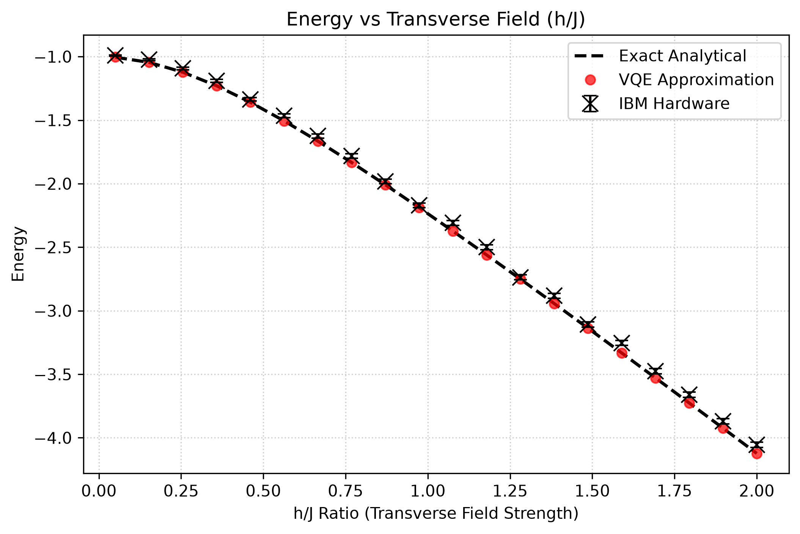
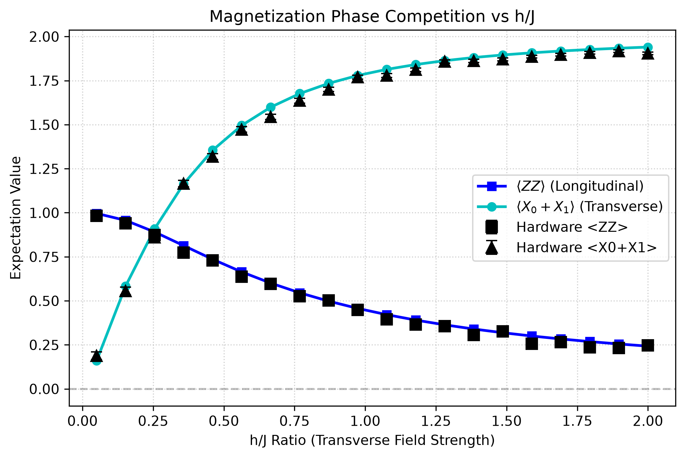
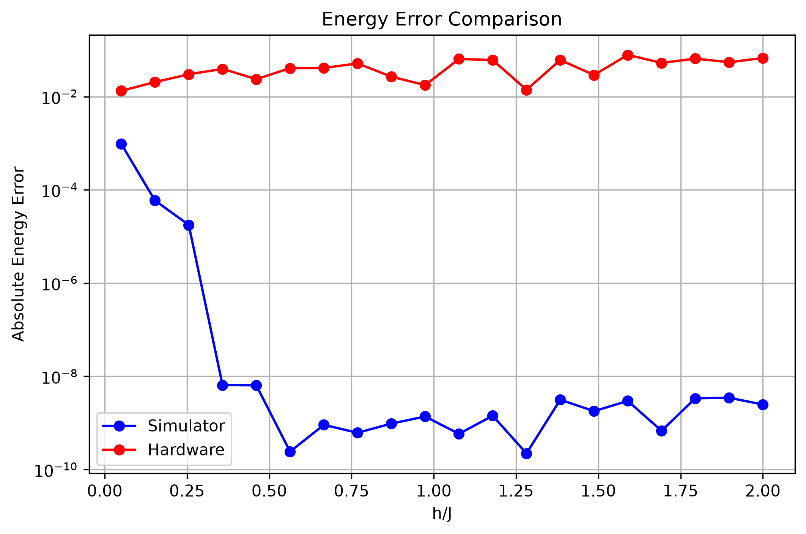
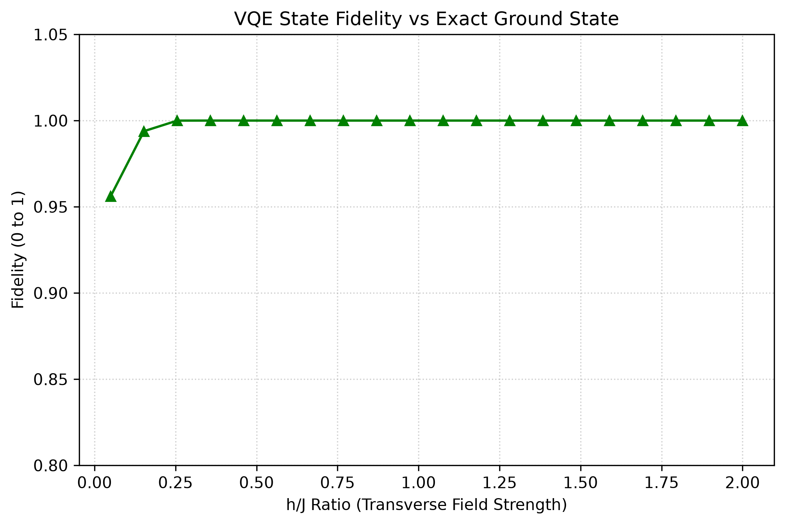
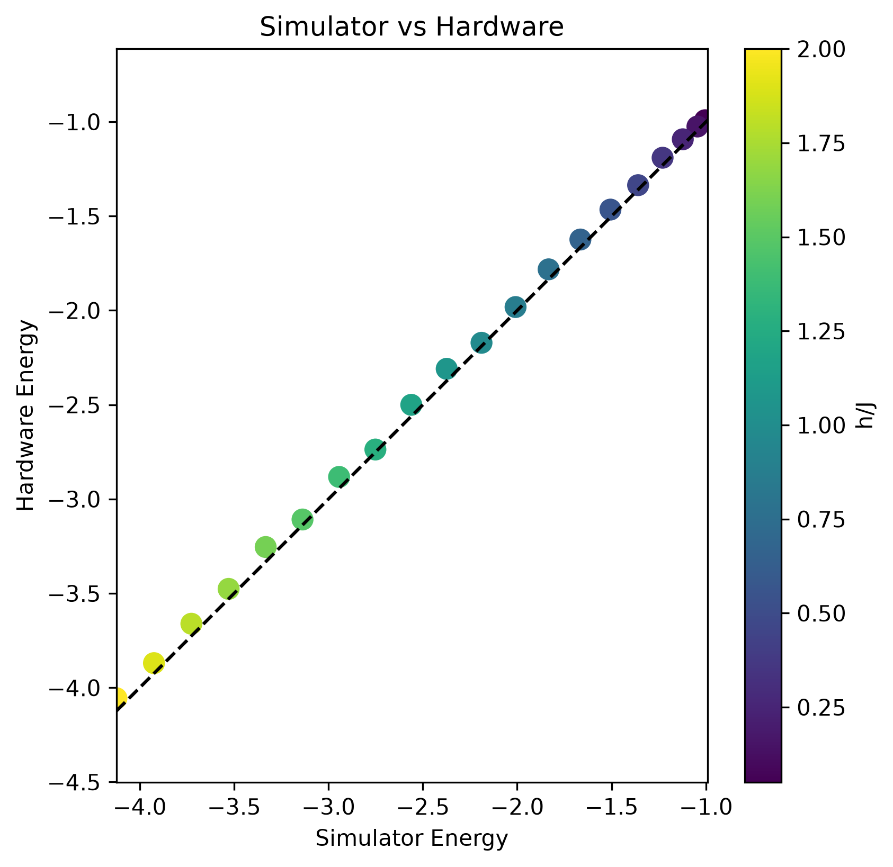
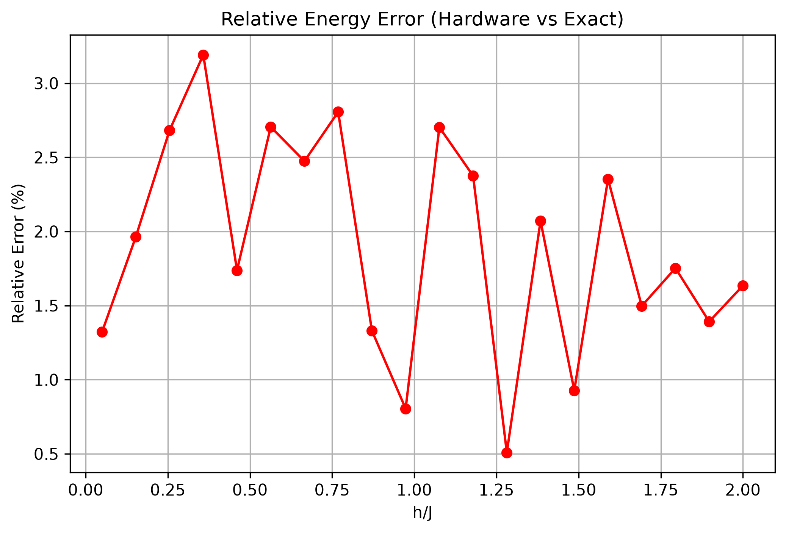

# Variational Quantum Eigensolver (VQE) for Transverse Field Ising Model (TFIM)

## 1. Overview

In quantum mechanics, finding the eigenvalues and ground states of a system's Hamiltonian is a fundamental problem. The ground state (the state of lowest energy) governs the low-temperature physics, phase transitions, and chemical properties of a quantum system. However, computing this ground state classically is extremely difficult due to the exponential growth of the Hilbert space. Specifically, for an $N$-spin system, the Hamiltonian is represented by a matrix of size $2^N \times 2^N$. For a modest system size of $N = 50$, storing and diagonalizing this matrix requires a Hilbert space of dimension $2^{50} \approx 1.13 \times 10^{15}$, which exceeds the memory capacity of any classical supercomputer.

The **Variational Quantum Eigensolver (VQE)** is a hybrid quantum-classical algorithm designed to address this challenge in the **Noisy Intermediate-Scale Quantum (NISQ)** era. VQE offloads the state preparation and expectation value measurement that are tasks that are naturally suited for quantum processors, to a quantum device. It then uses a classical optimizer to iteratively update the parameterized quantum state to find the minimum energy, adhering to the variational principle. This hybrid division of labor minimizes the required quantum circuit depth, making it resilient to certain forms of coherent quantum noise.

---

## 2. Mathematical Background

The time-independent Schrödinger equation (eigenvalue problem) is expressed as:

$
H|\psi_i\rangle = E_i|\psi_i\rangle
$

where:
* **Hamiltonian ($H$)**: A Hermitian operator ($H = H^\dagger$) representing the total energy of the physical system.
* **Ground State ($|\psi_0\rangle$)**: The eigenvector corresponding to the lowest eigenvalue $E_0$.
* **Expectation Value**: The average energy of a normalized trial state $|\psi\rangle$, given by:
  $
  \langle H \rangle = \langle\psi|H|\psi\rangle
  $

According to the **Variational Principle** in quantum mechanics, the expectation value of $H$ for any trial state $|\psi\rangle$ is always bounded from below by the true ground-state energy $E_0$:

$
\langle H \rangle = \langle\psi|H|\psi\rangle \geq E_0
$

This inequality forms the foundation of VQE. By preparing a parameterized trial state $|\psi(\theta)\rangle = U(\theta)|0\rangle$ (where $U(\theta)$ is a parameterized quantum circuit), we can express the energy as a function of the parameter vector $\theta$:


$
E(\theta) = \langle\psi(\theta)|H|\psi(\theta)\rangle
$


Minimizing this multi-dimensional scalar function $E(\theta)$ using a classical optimizer yields an approximation of the ground-state energy:

$
E_0 \approx \min_{\theta} E(\theta)
$

If the parameterized ansatz $U(\theta)$ is sufficiently expressible, the parameter search will converge to the true ground state.

### Computational Complexity

Exact diagonalization of a quantum Hamiltonian requires calculating eigenvalues of a $2^N \times 2^N$ matrix, where $N$ is the number of qubits or spins in the system. The Hilbert-space dimension grows as $2^N$ because each additional spin doubles the state space of the system due to the tensor product structure of multi-qubit states. Classically storing and manipulating these exponentially large matrices becomes computationally impossible for even modest system sizes.

VQE addresses this bottleneck by replacing the exponential memory requirements of classical exact diagonalization with repeated quantum circuit evaluations. Instead of storing the state vector classically, the quantum state is prepared directly on the quantum hardware, requiring only $N$ physical qubits. The expectation values are measured through statistical sampling of the circuit. However, this approach introduces different trade-offs: the accuracy and speed of the algorithm depend on the balance between the quantum circuit depth (which affects coherence and gate errors), the number of classical optimizer iterations, and physical hardware noise that limits measurement precision.

---

## 3. Algorithm

The VQE workflow is a closed-loop hybrid system consisting of quantum state preparation and measurement, followed by classical optimization.

### VQE Execution Flowchart

```
Define Hamiltonian (H)
          ↓
Initialize Parameters (θ)
          ↓
┌───→ Prepare Trial State |ψ(θ)⟩ = U(θ)|0⟩
│         ↓
│     Measure Expectation Values of Pauli Strings
│         ↓
│     Compute Total Energy E(θ)
│         ↓
│     Classical Optimizer updates parameters (θ)
│         ↓
└──── Converged? ── No
          ↓ Yes
  Output Ground State Energy & Parameters
```

### Detailed Steps:
1. **Hamiltonian Mapping**: The physical Hamiltonian is mapped into a sum of Pauli strings:
   $
   H = \sum_{j} c_j P_j
   $
   where $c_j \in \mathbb{R}$ and $P_j \in \{I, X, Y, Z\}^{\otimes N}$.
2. **State Preparation**: The trial state $|\psi(\theta)\rangle$ is prepared on the quantum device by applying a parameterized unitary ansatz $U(\theta)$ to the initial state $|0\rangle$.
3. **Expectation Value Measurement**: Because quantum hardware cannot measure non-local operators directly, the expectation value $\langle H \rangle$ is evaluated by measuring the individual expectation values of the Pauli strings $\langle P_j \rangle$ and summing them linearly:
   $
   E(\theta) = \sum_j c_j \langle \psi(\theta) | P_j | \psi(\theta) \rangle
   $
4. **Classical Parameter Update**: The scalar energy value $E(\theta)$ is fed into a classical optimization algorithm, which computes and proposes a new parameter set $\theta'$.
5. **Convergence Loop**: Steps 2–4 are repeated until the difference $|E(\theta^{(k)}) - E(\theta^{(k-1)})|$ falls below a set threshold, or the maximum number of iterations is reached.

---

## Atlas Architecture

Atlas is a modular quantum simulation framework that decouples physical model description from algorithm execution and hardware backend details. Experiments are configured via YAML and assembled by a factory layer. This document focuses on **VQE / TFIM validation**; Atlas also ships VQD and Hamiltonian simulation (Lie / Strang) with a separate lattice dashboard for dynamics.

The high-level architecture:

```
YAML config → load_config → factory/builders → experiment → outputs
```

Within the package (VQE-relevant subset):

```
Atlas
├── Config (AtlasConfig, YAML loading)
├── Hamiltonians (physics/)
├── Circuits / Ansätze (circuits/ansatzes/)
├── Algorithms
│   ├── VQE (algorithms/vqe.py)
│   ├── VQD (algorithms/vqd.py)
│   └── HamiltonianSimulation (algorithms/hamiltonian_sim.py)
├── Execution (simulator, IBM Runtime)
├── Experiments (TFIM VQE/VQD; dynamics under hamiltonian_sim_experiment.py)
├── Analysis (metrics)
└── Visualization (VQE/VQD plots; dynamics scalar plots + lattice dashboard)
```

Atlas maintains a clean separation between:

- **Hamiltonian definition** — physical parameters ($J$, $h$, `num_qubits`) independent of the solver
- **Quantum algorithms** — VQE minimizes energy; VQD finds successive eigenstates via overlap penalties
- **Hardware execution** — optional IBM Runtime evaluation after simulator optimization
- **Observable extraction** — magnetization and correlation functions from prepared states
- **Benchmarking and visualization** — fidelity, absolute error, CSV export, and plots per run

This modularity allows new algorithms, Hamiltonians, and backends to be registered in the builder layer without changing the overall workflow.

---

## 4. Implementation

Within Atlas, the TFIM VQE workflow is implemented as an n-qubit modular pipeline under `atlas/`. The reference implementation uses a hardware-efficient ansatz and SciPy COBYLA optimization; exact diagonalization provides analytical benchmarks for small systems.

### Hamiltonian Construction

#### Motivation for the TFIM Benchmark

The Transverse Field Ising Model (TFIM) is a canonical benchmark for variational quantum algorithms. It is exactly solvable for small systems, exhibits a quantum phase transition at $h/J = 1$, and scales to arbitrary chain length $N$ qubits.

For an $N$-qubit chain the Hamiltonian is:

$
H = -J \sum_{i=0}^{N-2} Z_i Z_{i+1} - h \sum_{i=0}^{N-1} X_i
$

In `atlas/physics/hamiltonians.py`, `TFIMHamiltonian` constructs this operator as a `SparsePauliOp` with:

- Nearest-neighbor $ZZ$ terms with coefficient $-J$
- On-site $X$ terms with coefficient $-h$

The class provides `exact_ground_state()` and `exact_spectrum(num_states)` for benchmarking VQE and VQD respectively.

### Ansatz

The trial wavefunction uses an **Hardware-Efficient Ansatz (HEA)** in `atlas/circuits/ansatzes/hardware_efficient.py`:

- Single-qubit $R_y$ rotations on each qubit
- CNOT entangling layers between adjacent qubits
- Configurable depth via the `reps` parameter in YAML

For the 2-qubit case with `reps=1`, the circuit has 4 parameters and one CNOT gate — sufficient to capture the real-amplitude ground states of the 2-qubit TFIM.

### Classical Optimization

- **Optimizer**: COBYLA (derivative-free), configured via YAML `optimizer.parameters`
- **Multi-start**: `num_starts` random initial points in $[0, 2\pi]^{\text{num\_params}}$; the best energy across starts is kept
- **Implementation**: `atlas/algorithms/vqe.py` delegates the multi-start loop to `_optimize_cost()`, which VQD reuses for excited-state stages

### Exact Diagonalization

`TFIMHamiltonian.exact_ground_state()` and `exact_spectrum()` use dense Hermitian diagonalization (`numpy.linalg.eigh`) on the Hamiltonian matrix. This is intended for small-system benchmarks only.

---

## 5. Hardware Execution

Optional IBM Quantum hardware evaluation is implemented in `atlas/execution/ibm_runtime.py` and wired through `atlas/experiments/tfim.py`.

### IBM Runtime Estimator

Hardware runs use Qiskit's `EstimatorV2` primitive to evaluate expectation values on real QPUs. Enable hardware in the YAML config:

```yaml
hardware:
  enabled: true
  backend_name: null   # auto-select least-busy backend when null
  resilience_level: 1
```

### Execution Pipeline

1. **Simulator optimization**: VQE (or VQD ground state) runs on the statevector backend.
2. **Parameter transfer**: Optimized parameters are evaluated on IBM hardware in a single job.
3. **Transpilation**: Preset pass manager maps the circuit to the target device layout.
4. **Resilience**: Readout error mitigation via `resilience_level`.
5. **Observables**: Energy and TFIM observables ($\langle ZZ \rangle$, $\langle X_0 + \cdots \rangle$) are returned in one execution.

*Note on Parameter Transfer*: Full VQE optimization loops on public QPUs are impractical due to queue latency. Atlas optimizes on the simulator and uses hardware for verification, matching the workflow of the legacy `vqe_legacy/` scripts.

---

## Variational Quantum Deflation (VQD)

Atlas also implements VQD in `atlas/algorithms/vqd.py`. VQD finds excited states sequentially:

1. Ground state: standard VQE energy minimization.
2. Excited states: minimize $E(\theta) + \beta \sum_j |\langle\psi(\theta)|\psi_j\rangle|^2$ where $|\psi_j\rangle$ are previously found states.

VQD reuses VQE's multi-start optimizer rather than duplicating the loop. Configure via YAML:

```yaml
algorithm:
  name: vqd
  parameters:
    num_states: 2
    beta: 1.0
```

Per-state absolute error and fidelity are reported against the exact spectrum from `exact_spectrum(num_states)`.

---

## Design Philosophy

The software design of Atlas enforces strict decoupling of the simulation pipeline:

```
YAML config → Hamiltonian → Algorithm → Backend → Experiment → Analysis → Visualization
```

This abstraction ensures that:

- **Algorithm-independence**: VQE, VQD, and exact diagonalization can run on the same Hamiltonian definition.
- **Backend-independence**: The same algorithm executes on simulators or IBM hardware without changing circuit definitions.
- **Config-independence**: Experiments are fully described by YAML; `main.py` only loads config and dispatches.
- **Analysis-independence**: Observables and metrics remain backend-agnostic for consistent comparison.

By framing these divisions as formal software architecture, Atlas remains extensible as algorithms and hardware evolve.

---

## 6. Validation Methodology

This module validates the quality of the VQE results by calculating the following physical and statistical metrics:

1. **Ground-State Energy ($E$)**: The minimum expectation value of the Hamiltonian.
2. **State Fidelity ($F$)**: Measures the overlap between the normalized VQE state vector $|\psi(\theta)\rangle$ and the exact ground state $|\psi_{\text{exact}}\rangle$:
   $
   F = |\langle\psi(\theta)|\psi_{\text{exact}}\rangle|^2
   $
   A fidelity of $1.0$ indicates perfect agreement.
3. **Longitudinal Magnetization ($\langle ZZ \rangle$)**: The expectation value of the spin-spin correlation operator $Z_0 \otimes Z_1$. In physics, this represents the spatial correlation of spins along the z-axis (the magnetic alignment order).
4. **Transverse Magnetization ($\langle X_0 + X_1 \rangle$)**: The expectation value of the sum of the transverse field operators. Physically, this measures how strongly the spins align with the external transverse magnetic field along the x-axis.
5. **Absolute Error ($\Delta E$)**: The absolute difference between the exact eigenvalue and the computed value:
   $
   \Delta E = |E_{\text{computed}} - E_{\text{exact}}|
   $
6. **Relative Error ($\%$ Error)**: The ratio of absolute error to the magnitude of the exact energy:
   $
   \text{Relative Error} = \frac{|E_{\text{computed}} - E_{\text{exact}}|}{|E_{\text{exact}}|} \times 100\%
   $
7. **Parity Plot**: Plots the simulator energy against the hardware energy across different transverse fields to highlight the systematic deviation.

---

## Running Benchmarks

Atlas experiments are launched from YAML config files:

```bash
# Single-point VQE
python -m atlas.main --config configs/tfim_vqe_single.yaml

# h-sweep VQE benchmark (CSV + plots)
python -m atlas.main --config configs/tfim_vqe.yaml

# Single-point VQD (multi-state)
python -m atlas.main --config configs/tfim_vqd.yaml
```

Each run writes outputs to a unique directory:

```text
atlas/data/{experiment_name}_{YYYYMMDD_HHMMSS}/
```

The benchmark figures below were generated from the legacy monolithic workflow and remain representative of VQE validation results. Current Atlas runs produce equivalent plot types under the per-run output directory when `output.plots: true`. Note that modern VQE sweeps write `infidelity_vs_hJ.png` (log-scale infidelity); the figure labeled “fidelity” below is from the legacy asset set.

---

### 7.1. Ground State Energy vs $h/J$


<br>


* **Purpose**: Verify that VQE simulation and hardware executions accurately capture the ground-state energy across the transverse field sweep $h/J \in [0.05, 2.0]$.
* **Observation**: The VQE simulation (red circles) lies exactly on top of the exact analytical solution (black dashed line). The IBM Hardware data points (black crosses) follow the exact curve closely but are shifted slightly upwards (less negative).
* **Interpretation**: The hardware-efficient ansatz is expressive enough to represent the ground state. The systematic upward shift of the physical hardware results represents a higher energy, which is consistent with the variational principle: physical noise (decoherence, gate infidelities) forces the prepared state to be mixed, raising the observed energy.

### 7.2. Magnetization Phase Competition

<br>

* **Purpose**: Identify the quantum phase transition of the TFIM system.
* **Observation**: At small $h/J \ll 1$, the longitudinal correlation $\langle ZZ \rangle$ is close to $1.0$, while the transverse magnetization $\langle X_0+X_1 \rangle$ is near $0$. As $h/J$ increases, the curves cross over near $h/J \approx 1.0$. The hardware results follow this trend but are slightly compressed towards $0$.
* **Interpretation**: This illustrates the quantum phase transition from a ordered ferromagnetic phase (where spins align along the z-axis, maximizing $\langle ZZ \rangle$) to a disordered paramagnetic phase (where spins align with the transverse field along the x-axis). The compression of the hardware curves reflects depolarizing noise, which drives the expectation values towards the mixed-state value of $0$.

### 7.3. Absolute Energy Error Comparison

<br>

* **Purpose**: Contrast the precision of the noiseless simulator with physical quantum hardware.
* **Observation**: The simulator's absolute energy error fluctuates between $10^{-4}$ and $10^{-9}$, while the hardware error remains between $10^{-2}$ and $10^{-1}$.
* **Interpretation**: The simulator easily finds the global minimum, limited only by the optimizer's numerical tolerance. The hardware error is dominated by physical noise, but remains well within a reasonable tolerance (~1.9% average relative error).

### 7.4. State Fidelity vs $h/J$

<br>

* **Purpose**: Track the state preparation quality of the VQE simulator.
* **Observation**: The state fidelity is extremely high ($>0.999$) for almost the entire range, showing a tiny dip near $h/J \approx 0.05$ and $0.15$ where it is $0.956$ and $0.993$ respectively.
* **Interpretation**: The optimizer reliably finds parameters that reproduce the exact quantum state vector. The minor dip at very small $h/J$ is caused by the flatter optimization landscapes (near-degenerate or highly-ordered states) where the classical optimizer can occasionally converge slightly early.

### 7.5. Simulator vs Hardware Parity

<br>

* **Purpose**: Correlate the simulation energy against physical hardware measurements.
* **Observation**: The data points form a linear sequence parallel to the $y=x$ line but are shifted consistently upwards.
* **Interpretation**: The systematic offset indicates that the noise on the QPU acts as a global perturbation, shifting the measured expectation values uniformly but preserving the relative trend of the physical observables.

### 7.6. Relative Energy Error

<br>

* **Purpose**: Benchmark the relative accuracy of the IBM QPU.
* **Observation**: The relative error starts around 1.3%, peaks near $h/J = 0.36$ at 3.19%, and decreases to under 1% at $h/J \approx 1.28$, with an average of **1.91%**.
* **Interpretation**: The average relative error of under 2% demonstrates that physical execution on `ibm_kingston` is highly reliable for qualitative model verification.

---

## 8. Discussion

### Strengths
* **Highly Compact Ansatz**: The 4-parameter hardware-efficient ansatz requires only a single CNOT gate and four single-qubit rotations, minimizing the circuit depth and limiting the time window for decoherence.
* **Classical Pre-Optimization**: Running hundreds of optimizer iterations directly on today's public QPUs is prohibitively expensive in terms of queue latency and quantum execution resources. By running the optimization loop classically and reserving the QPU only for the final evaluation, we demonstrate the practical feasibility of hybrid quantum algorithms on existing hardware infrastructure.
* **Error Mitigation Effectiveness**: The use of `resilience_level=1` (readout mitigation) successfully holds the average relative energy error below 2.0%.

### Current Limitations
* **Hardware Noise**: Gate infidelities, thermal relaxation, and qubit crosstalk produce a systematic energy offset (mean absolute error of **0.04261**, max error of **0.07843**).
* **COBYLA Limitations**: As the parameter count and qubit size grow, COBYLA's performance scales poorly due to the lack of gradient information, making it prone to getting stuck in local minima.
* **System Size**: Exact diagonalization scales exponentially; while Atlas supports n-qubit TFIM chains, reliable variational convergence becomes harder as `num_qubits` and ansatz depth grow.

### Scalability
As the system scales to $N$ qubits:
1. The circuit depth of the hardware-efficient ansatz scales linearly ($O(N)$) for 1D configurations, but gate errors accumulate exponentially.
2. The number of parameters scales as $O(N)$ per layer, leading to high-dimensional non-convex optimization surfaces.
3. **Barren Plateaus**: The gradient of the cost function vanishes exponentially with the number of qubits, making classical optimization hard without specialized initializations.

---

## Atlas Roadmap

VQE, VQD, and Hamiltonian simulation (Lie / Strang product formulas) are
implemented in the current Atlas framework. Future development expands into a
broader quantum simulation platform:

- **Qubit count expansion**: Extend TFIM benchmarks to 8 and 16 qubits.
- **Alternative ansätze**: Unitary Coupled Cluster (UCCSD) and Hamiltonian Variational Ansatz (HVA).
- **Advanced error mitigation**: Zero-noise extrapolation (ZNE) and probabilistic error cancellation (PEC) via Mitiq.
- **Additional Hamiltonians**: Heisenberg, Hubbard, molecular systems.
- **Richer dynamics methods**: Higher-order Suzuki formulas, randomized product formulas, QSP / qubitization.

```
Current
✓ YAML-driven configuration
✓ Variational Quantum Eigensolver (VQE)
✓ Variational Quantum Deflation (VQD)
✓ Hamiltonian simulation (Lie / Strang) + lattice dashboard
✓ n-qubit TFIM and hardware-efficient ansatz
✓ IBM Quantum Runtime integration (variational path)

↓

Expanded ansätze and system sizes

↓

Richer dynamics methods / additional Hamiltonians

↓

Hardware-aware error mitigation

↓

Additional physical systems
```

---
