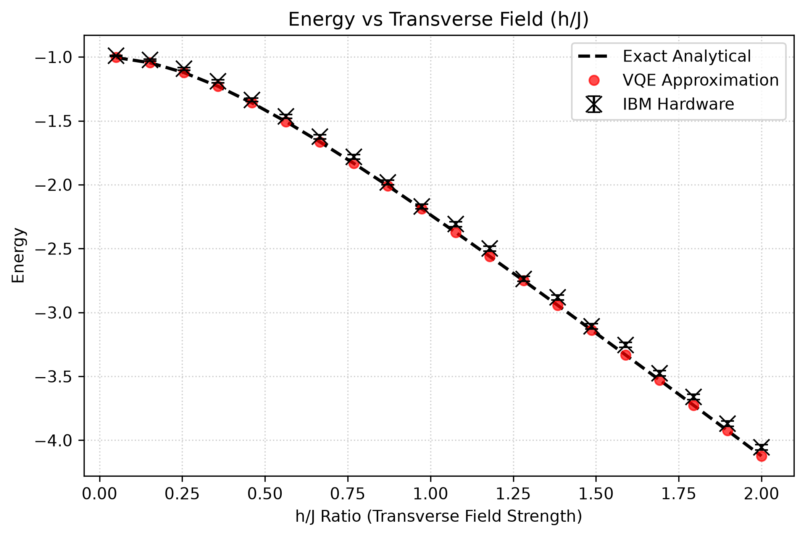
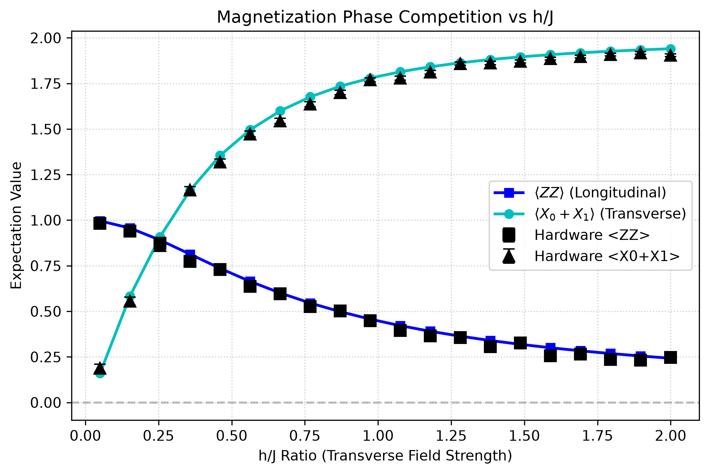
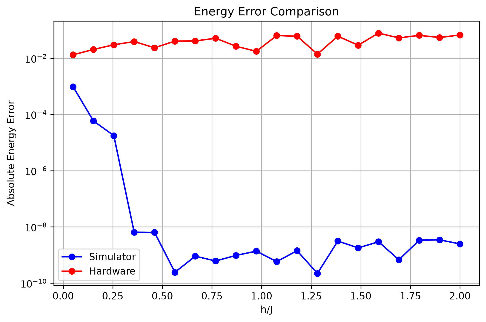
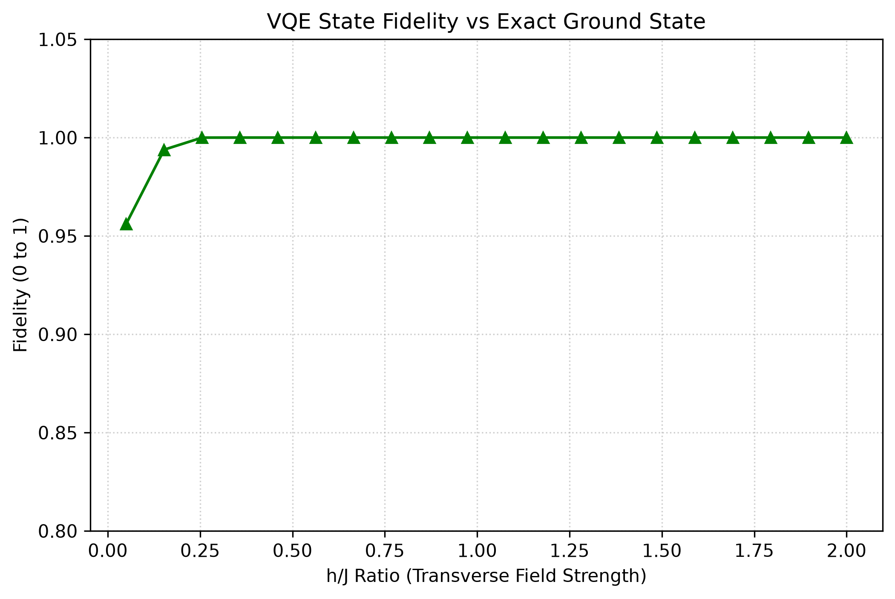
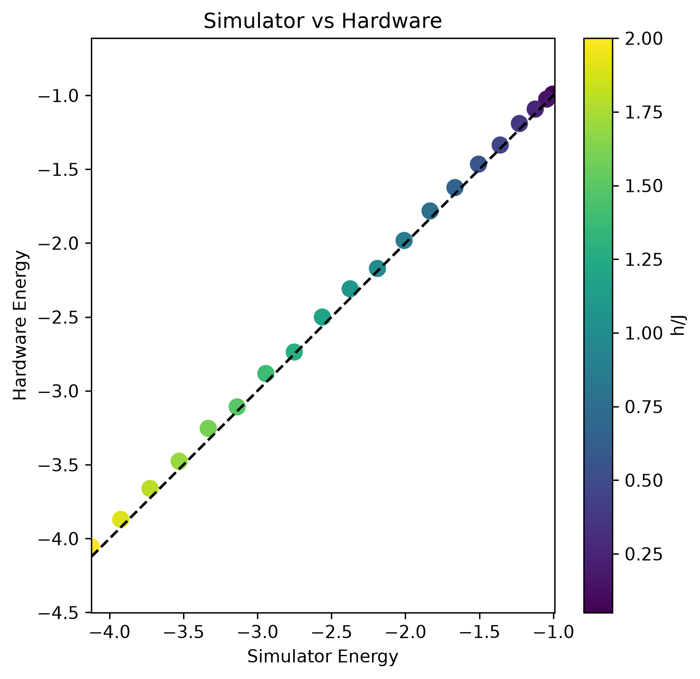
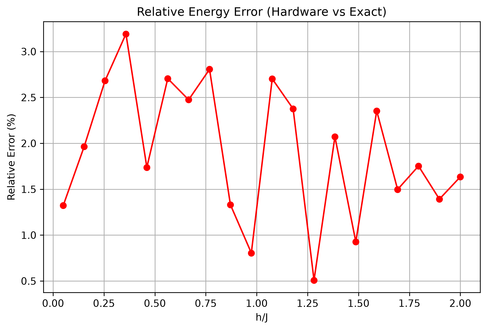

# Variational Quantum Eigensolver (VQE) for Transverse Field Ising Model (TFIM)

## 1. Overview

In quantum mechanics, finding the eigenvalues and ground states of a system's Hamiltonian is a fundamental problem. The ground state (the state of lowest energy) governs the low-temperature physics, phase transitions, and chemical properties of a quantum system. However, computing this ground state classically is extremely difficult due to the exponential growth of the Hilbert space. Specifically, for an $N$-spin system, the Hamiltonian is represented by a matrix of size $2^N \times 2^N$. For a modest system size of $N = 50$, storing and diagonalizing this matrix requires a Hilbert space of dimension $2^{50} \approx 1.13 \times 10^{15}$, which exceeds the memory capacity of any classical supercomputer.

The **Variational Quantum Eigensolver (VQE)** is a hybrid quantum-classical algorithm designed to address this challenge in the **Noisy Intermediate-Scale Quantum (NISQ)** era. VQE offloads the state preparation and expectation value measurement that are tasks that are naturally suited for quantum processors, to a quantum device. It then uses a classical optimizer to iteratively update the parameterized quantum state to find the minimum energy, adhering to the variational principle. This hybrid division of labor minimizes the required quantum circuit depth, making it resilient to certain forms of coherent quantum noise.

---

## 2. Mathematical Background

The time-independent Schrödinger equation (eigenvalue problem) is expressed as:

$
H|\psi_i\rangle = E_i|\psi_i\rangle
$

where:
* **Hamiltonian ($H$)**: A Hermitian operator ($H = H^\dagger$) representing the total energy of the physical system.
* **Ground State ($|\psi_0\rangle$)**: The eigenvector corresponding to the lowest eigenvalue $E_0$.
* **Expectation Value**: The average energy of a normalized trial state $|\psi\rangle$, given by:
  $
  \langle H \rangle = \langle\psi|H|\psi\rangle
  $

According to the **Variational Principle** in quantum mechanics, the expectation value of $H$ for any trial state $|\psi\rangle$ is always bounded from below by the true ground-state energy $E_0$:

$
\langle H \rangle = \langle\psi|H|\psi\rangle \geq E_0
$

This inequality forms the foundation of VQE. By preparing a parameterized trial state $|\psi(\theta)\rangle = U(\theta)|0\rangle$ (where $U(\theta)$ is a parameterized quantum circuit), we can express the energy as a function of the parameter vector $\theta$:


$
E(\theta) = \langle\psi(\theta)|H|\psi(\theta)\rangle
$


Minimizing this multi-dimensional scalar function $E(\theta)$ using a classical optimizer yields an approximation of the ground-state energy:

$
E_0 \approx \min_{\theta} E(\theta)
$

If the parameterized ansatz $U(\theta)$ is sufficiently expressible, the parameter search will converge to the true ground state.

### Computational Complexity

Exact diagonalization of a quantum Hamiltonian requires calculating eigenvalues of a $2^N \times 2^N$ matrix, where $N$ is the number of qubits or spins in the system. The Hilbert-space dimension grows as $2^N$ because each additional spin doubles the state space of the system due to the tensor product structure of multi-qubit states. Classically storing and manipulating these exponentially large matrices becomes computationally impossible for even modest system sizes.

VQE addresses this bottleneck by replacing the exponential memory requirements of classical exact diagonalization with repeated quantum circuit evaluations. Instead of storing the state vector classically, the quantum state is prepared directly on the quantum hardware, requiring only $N$ physical qubits. The expectation values are measured through statistical sampling of the circuit. However, this approach introduces different trade-offs: the accuracy and speed of the algorithm depend on the balance between the quantum circuit depth (which affects coherence and gate errors), the number of classical optimizer iterations, and physical hardware noise that limits measurement precision.

---

## 3. Algorithm

The VQE workflow is a closed-loop hybrid system consisting of quantum state preparation and measurement, followed by classical optimization.

### VQE Execution Flowchart

```
Define Hamiltonian (H)
          ↓
Initialize Parameters (θ)
          ↓
┌───→ Prepare Trial State |ψ(θ)⟩ = U(θ)|0⟩
│         ↓
│     Measure Expectation Values of Pauli Strings
│         ↓
│     Compute Total Energy E(θ)
│         ↓
│     Classical Optimizer updates parameters (θ)
│         ↓
└──── Converged? ── No
          ↓ Yes
  Output Ground State Energy & Parameters
```

### Detailed Steps:
1. **Hamiltonian Mapping**: The physical Hamiltonian is mapped into a sum of Pauli strings:
   $
   H = \sum_{j} c_j P_j
   $
   where $c_j \in \mathbb{R}$ and $P_j \in \{I, X, Y, Z\}^{\otimes N}$.
2. **State Preparation**: The trial state $|\psi(\theta)\rangle$ is prepared on the quantum device by applying a parameterized unitary ansatz $U(\theta)$ to the initial state $|0\rangle$.
3. **Expectation Value Measurement**: Because quantum hardware cannot measure non-local operators directly, the expectation value $\langle H \rangle$ is evaluated by measuring the individual expectation values of the Pauli strings $\langle P_j \rangle$ and summing them linearly:
   $
   E(\theta) = \sum_j c_j \langle \psi(\theta) | P_j | \psi(\theta) \rangle
   $
4. **Classical Parameter Update**: The scalar energy value $E(\theta)$ is fed into a classical optimization algorithm, which computes and proposes a new parameter set $\theta'$.
5. **Convergence Loop**: Steps 2–4 are repeated until the difference $|E(\theta^{(k)}) - E(\theta^{(k-1)})|$ falls below a set threshold, or the maximum number of iterations is reached.

---

## Atlas Architecture

Atlas is a modular quantum simulation framework designed to decouple the physical model description from the quantum algorithm execution and hardware backend details. Within this framework, the VQE implementation documented here is one algorithmic component that fits into the broader suite of modular capabilities.

The high-level architecture of Atlas is structured as follows:

```
Atlas
├── Hamiltonians
├── Algorithms
│   ├── VQE
│   ├── VQD (planned)
│   └── ...
├── Hardware
├── Observables
├── Benchmarking
└── Visualization
```

Atlas maintains a clean separation between:
* **Hamiltonian definition**: Describing the physical system's interactions (e.g., TFIM parameters $J$ and $h$) independently of the solver.
* **Quantum algorithms**: The variational or dynamical algorithms (e.g., VQE) that process the Hamiltonian.
* **Hardware execution**: Defining the target backend, circuit transpilation, and execution modes (simulators vs. physical QPUs).
* **Observable extraction**: Reconstructing correlation functions and physical properties from quantum measurements.
* **Benchmarking and visualization**: Plotting parity, magnetization curves, and error analysis against classical baselines.

This modularity allows developers to integrate new algorithms, alternative physical models, and different hardware backends without changing the overall simulation workflow.

---

## 4. Implementation

Within Atlas, the VQE module contains a modular python implementation tailored to a 2-qubit system.

### Hamiltonian Construction

#### Motivation for the TFIM Benchmark
The Transverse Field Ising Model (TFIM) was selected for this module as a canonical benchmark for quantum algorithms. It is a fundamental model in condensed matter physics that is exactly solvable for small systems, providing a reliable analytical baseline to verify quantum calculations. Furthermore, it exhibits a non-trivial quantum phase transition at $h/J = 1$, serves as a scalable starting point for larger spin chains, and is commonly used across the quantum information science community to validate new VQE implementations.

The system represents a 2-qubit **Transverse Field Ising Model (TFIM)**:

$
H = -J Z_0 Z_1 - h(X_0 + X_1)
$

where:
* $J$ is the coupling constant (ferromagnetic when $J > 0$).
* $h$ is the transverse magnetic field strength.

In [tfim_phy.py](../vqe/physics/tfim_phy.py), the function [get_tfim_hamiltonian](../vqe/physics/tfim_phy.py#L5) constructs this operator using Qiskit's `SparsePauliOp` from a list of Pauli terms:
* Term 1: `ZZ` with coefficient $-J$
* Term 2: `XI` with coefficient $-h$
* Term 3: `IX` with coefficient $-h$

### Ansatz
The trial wavefunction is constructed using a 2-qubit **Hardware-Efficient Ansatz (HEA)** in [tfim_optimizer.py](../vqe/optimizer/tfim_optimizer.py#L14):

```
     ┌──────────┐     ┌──────────┐
q_0: ┤ Ry(θ[0]) ├──■──┤ Ry(θ[2]) ├
     ├──────────┤┌─┴─┐├──────────┤
q_1: ┤ Ry(θ[1]) ├┤ X ├┤ Ry(θ[3]) ├
     └──────────┘└───┘└──────────┘
```

* **Parameter Count**: 4 parameters ($\theta_0, \theta_1, \theta_2, \theta_3$).
* **Entangling Structure**: A single CNOT gate between qubit 0 and qubit 1.
* **Expressibility**: This structure is chosen because the ground states of the 2-qubit TFIM have purely real amplitudes. The $R_y$ rotation gates restrict the state space to real coordinates, while the CNOT gate generates the entanglement needed to capture the spin-spin correlation.

### Classical Optimization
* **Optimizer**: The COBYLA (Constrained Optimization BY Linear Approximations) algorithm is used. It is a derivative-free method, making it less sensitive to statistical measurement noise compared to gradient-based methods.
* **Stopping Criteria**: A limit of `maxiter=200` function evaluations is set in the optimizer.
* **Multi-start Optimization**: To avoid getting trapped in local minima , the function [run_vqe_sim](../vqe/optimizer/tfim_optimizer.py#L7) implements a multi-start strategy. It samples uniform random initial guesses from $[0, 2\pi]^4$ and tracks the overall minimum energy.
* **Convergence Metrics**: Evaluated via the minimum cost function value and the total function evaluations.

### Exact Diagonalization
As an analytical benchmark, [calculate_exact_solution](../vqe/physics/tfim_phy.py#L14) constructs the dense matrix of the Hamiltonian and applies NumPy's Hermetian eigensolver `numpy.linalg.eigh`. It returns the lowest eigenvalue (ground-state energy) and its corresponding eigenvector.

---

## 5. Hardware Execution

Quantum hardware validation is implemented in [tfim_hardware_run.py](../vqe/tfim_hardware_run.py) using the **IBM Qiskit Runtime** platform.

### IBM Runtime Estimator
The script uses Qiskit's `EstimatorV2` primitive (`mode=backend`) which calculates expectation values directly on real QPUs.

#### Estimator Design Choice
The `Estimator` primitive was selected for hardware execution rather than `Sampler`. While the `Sampler` primitive is designed to return the probability distribution of raw bitstrings, the `Estimator` is optimized to directly evaluate the expectation values of physical observables (like the Hamiltonian or magnetization operators). Because VQE operates by minimizing energy expectation values rather than measurement probabilities, using the `Estimator` avoids unnecessary classical post-processing of bitstrings and naturally aligns with the variational objective of the algorithm.

### Transpilation and Execution Pipeline
1. **Ansatz Parameter Assignment**: The optimized parameters $\theta$ obtained from simulation are assigned to the `QuantumCircuit` representation of the HEA.
2. **Preset Pass Manager**: A preset pass manager (`generate_preset_pass_manager` with `optimization_level=3`) maps the virtual 2-qubit circuit onto the physical layout of the target hardware device (e.g., `ibm_kingston`). This transpilation ensures optimal routing, gate synthesis, and instruction scheduling.
3. **Observables Transpilation**: The Hamiltonian, longitudinal correlation $ZZ$, and transverse magnetizations $X_0+X_1$ are mapped using `apply_layout` to align with the physical qubits chosen during transpilation.
4. **Resilience Level**: The estimator is run with `resilience_level = 1`, which automatically performs readout error mitigation (measurement error mitigation) to refine the expectation values.
5. **Observed Metrics**: The hardware returns the expectation values for the energy, correlation, and magnetization in a single combined execution job.

*Note on Parameter Transfer*: Due to the queue latency of public QPUs, executing a full VQE classical optimization loop (requiring hundreds of sequential quantum runs) directly on physical hardware is highly inefficient. Therefore, the parameters are pre-optimized in a noiseless simulation and then transferred to the QPU for a single-shot verification.

---

## Design Philosophy

The software design of Atlas enforces a strict decoupling of the simulation pipeline into independent components:

```
Hamiltonian
      ↓
Algorithm
      ↓
Backend
      ↓
Analysis
```

This abstraction ensures that:
* **Algorithm-independence**: Multiple algorithms (such as VQE or exact diagonalization) can run on the exact same Hamiltonian definition.
* **Backend-independence**: The same algorithm can execute seamlessly on noiseless simulators, noisy local backends, or physical hardware without altering the circuit definitions.
* **Analysis-independence**: Observables and benchmarking metrics remain backend-agnostic, allowing consistent comparative evaluation of results.

By framing these divisions as a formal software architecture choice rather than an implementation detail, Atlas remains extensible and robust to future quantum hardware developments.

---

## 6. Validation Methodology

This module validates the quality of the VQE results by calculating the following physical and statistical metrics:

1. **Ground-State Energy ($E$)**: The minimum expectation value of the Hamiltonian.
2. **State Fidelity ($F$)**: Measures the overlap between the normalized VQE state vector $|\psi(\theta)\rangle$ and the exact ground state $|\psi_{\text{exact}}\rangle$:
   $
   F = |\langle\psi(\theta)|\psi_{\text{exact}}\rangle|^2
   $
   A fidelity of $1.0$ indicates perfect agreement.
3. **Longitudinal Magnetization ($\langle ZZ \rangle$)**: The expectation value of the spin-spin correlation operator $Z_0 \otimes Z_1$. In physics, this represents the spatial correlation of spins along the z-axis (the magnetic alignment order).
4. **Transverse Magnetization ($\langle X_0 + X_1 \rangle$)**: The expectation value of the sum of the transverse field operators. Physically, this measures how strongly the spins align with the external transverse magnetic field along the x-axis.
5. **Absolute Error ($\Delta E$)**: The absolute difference between the exact eigenvalue and the computed value:
   $
   \Delta E = |E_{\text{computed}} - E_{\text{exact}}|
   $
6. **Relative Error ($\%$ Error)**: The ratio of absolute error to the magnitude of the exact energy:
   $
   \text{Relative Error} = \frac{|E_{\text{computed}} - E_{\text{exact}}|}{|E_{\text{exact}}|} \times 100\%
   $
7. **Parity Plot**: Plots the simulator energy against the hardware energy across different transverse fields to highlight the systematic deviation.

---

## 7. Results

The benchmark figures and plots generated from the run are shown below.

### 7.1. Ground State Energy vs $h/J$


<br>


* **Purpose**: Verify that VQE simulation and hardware executions accurately capture the ground-state energy across the transverse field sweep $h/J \in [0.05, 2.0]$.
* **Observation**: The VQE simulation (red circles) lies exactly on top of the exact analytical solution (black dashed line). The IBM Hardware data points (black crosses) follow the exact curve closely but are shifted slightly upwards (less negative).
* **Interpretation**: The hardware-efficient ansatz is expressive enough to represent the ground state. The systematic upward shift of the physical hardware results represents a higher energy, which is consistent with the variational principle: physical noise (decoherence, gate infidelities) forces the prepared state to be mixed, raising the observed energy.

### 7.2. Magnetization Phase Competition

<br>

* **Purpose**: Identify the quantum phase transition of the TFIM system.
* **Observation**: At small $h/J \ll 1$, the longitudinal correlation $\langle ZZ \rangle$ is close to $1.0$, while the transverse magnetization $\langle X_0+X_1 \rangle$ is near $0$. As $h/J$ increases, the curves cross over near $h/J \approx 1.0$. The hardware results follow this trend but are slightly compressed towards $0$.
* **Interpretation**: This illustrates the quantum phase transition from a ordered ferromagnetic phase (where spins align along the z-axis, maximizing $\langle ZZ \rangle$) to a disordered paramagnetic phase (where spins align with the transverse field along the x-axis). The compression of the hardware curves reflects depolarizing noise, which drives the expectation values towards the mixed-state value of $0$.

### 7.3. Absolute Energy Error Comparison

<br>

* **Purpose**: Contrast the precision of the noiseless simulator with physical quantum hardware.
* **Observation**: The simulator's absolute energy error fluctuates between $10^{-4}$ and $10^{-9}$, while the hardware error remains between $10^{-2}$ and $10^{-1}$.
* **Interpretation**: The simulator easily finds the global minimum, limited only by the optimizer's numerical tolerance. The hardware error is dominated by physical noise, but remains well within a reasonable tolerance (~1.9% average relative error).

### 7.4. State Fidelity vs $h/J$

<br>

* **Purpose**: Track the state preparation quality of the VQE simulator.
* **Observation**: The state fidelity is extremely high ($>0.999$) for almost the entire range, showing a tiny dip near $h/J \approx 0.05$ and $0.15$ where it is $0.956$ and $0.993$ respectively.
* **Interpretation**: The optimizer reliably finds parameters that reproduce the exact quantum state vector. The minor dip at very small $h/J$ is caused by the flatter optimization landscapes (near-degenerate or highly-ordered states) where the classical optimizer can occasionally converge slightly early.

### 7.5. Simulator vs Hardware Parity

<br>

* **Purpose**: Correlate the simulation energy against physical hardware measurements.
* **Observation**: The data points form a linear sequence parallel to the $y=x$ line but are shifted consistently upwards.
* **Interpretation**: The systematic offset indicates that the noise on the QPU acts as a global perturbation, shifting the measured expectation values uniformly but preserving the relative trend of the physical observables.

### 7.6. Relative Energy Error

<br>

* **Purpose**: Benchmark the relative accuracy of the IBM QPU.
* **Observation**: The relative error starts around 1.3%, peaks near $h/J = 0.36$ at 3.19%, and decreases to under 1% at $h/J \approx 1.28$, with an average of **1.91%**.
* **Interpretation**: The average relative error of under 2% demonstrates that physical execution on `ibm_kingston` is highly reliable for qualitative model verification.

---

## 8. Discussion

### Strengths
* **Highly Compact Ansatz**: The 4-parameter hardware-efficient ansatz requires only a single CNOT gate and four single-qubit rotations, minimizing the circuit depth and limiting the time window for decoherence.
* **Classical Pre-Optimization**: Running hundreds of optimizer iterations directly on today's public QPUs is prohibitively expensive in terms of queue latency and quantum execution resources. By running the optimization loop classically and reserving the QPU only for the final evaluation, we demonstrate the practical feasibility of hybrid quantum algorithms on existing hardware infrastructure.
* **Error Mitigation Effectiveness**: The use of `resilience_level=1` (readout mitigation) successfully holds the average relative energy error below 2.0%.

### Current Limitations
* **Hardware Noise**: Gate infidelities, thermal relaxation, and qubit crosstalk produce a systematic energy offset (mean absolute error of **0.04261**, max error of **0.07843**).
* **COBYLA Limitations**: As the parameter count and qubit size grow, COBYLA's performance scales poorly due to the lack of gradient information, making it prone to getting stuck in local minima.
* **System Size**: The current 2-qubit system size is small enough to be trivially simulated classically.

### Scalability
As the system scales to $N$ qubits:
1. The circuit depth of the hardware-efficient ansatz scales linearly ($O(N)$) for 1D configurations, but gate errors accumulate exponentially.
2. The number of parameters scales as $O(N)$ per layer, leading to high-dimensional non-convex optimization surfaces.
3. **Barren Plateaus**: The gradient of the cost function vanishes exponentially with the number of qubits, making classical optimization hard without specialized initializations.

---

## Atlas Roadmap

The VQE implementation represents the first completed algorithmic module within Atlas. Future development will expand the framework into a broader quantum simulation platform.

* Variational Quantum Deflation (VQD): Modify the cost function with an overlap penalty to find excited state energies:
   $
   E_1(\theta) = \langle\psi(\theta)|H|\psi(\theta)\rangle + \beta |\langle\psi(\theta)|\psi_0\rangle|^2
   $
* Qubit Count Expansion: Extend the TFIM implementation to 4, 8, and 16 qubits.
* Alternative Ansätze: Implement the **Unitary Coupled Cluster (UCCSD)** or **Hamiltonian Variational Ansatz (HVA)** for better physical expressibility.
* Advanced Error Mitigation: Integrate zero-noise extrapolation (ZNE) and probabilistic error cancellation (PEC) using Mitiq.
* Real-time Quantum Dynamics: Simulate time-evolution of TFIM using Trotter-Suzuki decomposition.

Below is the intended progression of the framework's roadmap:

```
Current
✓ Variational Quantum Eigensolver (VQE)

↓

Variational Quantum Deflation (VQD)

↓

Quantum Dynamics
(Trotterization, Product Formula Methods)

↓

Hardware-Aware Execution
(Error Mitigation, Noise Characterization)

↓

Additional Physical Systems
(Heisenberg, Hubbard, Molecular Hamiltonians)
```

---
